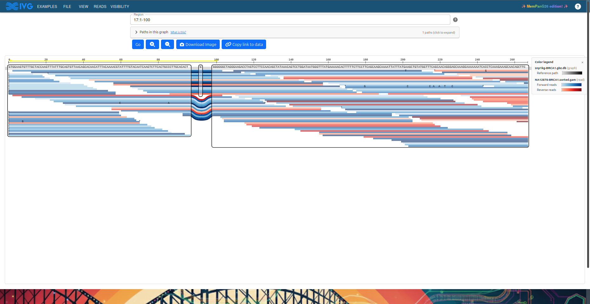

# seqTubeMaps — MemPanG26 Edition

MemPanG26 Hackathon Team 2 — [Colin Diesh](https://github.com/cmdcolin) &
[Rafeed Rahman Turjya](https://scholar.google.com/citations?user=Vb6tJA0AAAAJ&hl=en)
et al.

Fork of https://github.com/vgteam/sequenceTubeMap — adds browser-based uploads,
a modernised React/TypeScript UI, and the ability to send data to the vgteam's
public server.

Live demo — https://cmdcolin.github.io/sequenceTubeMap/

## Screenshot

## Quickstart

Use **File → Open…** to load your own data. The dialog explains both options:

- **vgteam server** (default) — drop `.xg`, `.vg`, or `.gbz` graphs and `.gam`/`.gaf` reads directly; processed by `vg` on `api.tubemap.graphs.vg`. 5 MB limit.
- **In-browser** — files stay on your machine, but graphs must first be converted to `.gbz.db` (requires `vg` + `gbz-base`). Hosted `.gbz.db` URLs are read by HTTP range requests, so whole-chromosome graphs work without a download.

→ [Full data preparation guide](doc/uploading.md)

## Navigation

Use `<contig>:<start>-<end>` (e.g. `Circ1:0-1320`). Open **Paths in this graph**
to see available contig names.

## More docs

- [Data preparation & hosting options](doc/uploading.md)
- [Headless SVG/PNG rendering](doc/headless-rendering.md)
- [In-browser gbz-base reader](doc/gbz-base.md)
- [Deep-link URL format](doc/linking.md)

## Features added vs. upstream

- Serverless in-browser mode — `.gbz.db` graphs read in pure TypeScript ([`@gmod/gbz-base`](https://github.com/GMOD/gbz-base-js), range requests for hosted files) + GAM parsing, no server needed
- Upload to vgteam server — File → Open sends `.xg`/`.vg` to `api.tubemap.graphs.vg` (CORS-compatible, wildcard `*`)
- App-bar GUI — all settings on one screen, contextual visibility
- Path picker — one-click path loading, no need to hand-type contig names
- Node labels, hover tooltips, right-click actions on reads and nodes
- React + TypeScript, React Compiler, MUI AppBar, SWR
- And more — see commit history

## Thanks

Big thanks to the MemPanG26 organizers and group!

https://pangenome.github.io/MemPanG26/

And the original sequenceTubeMap developers!

---

_Claude Code AI was used during this work._
