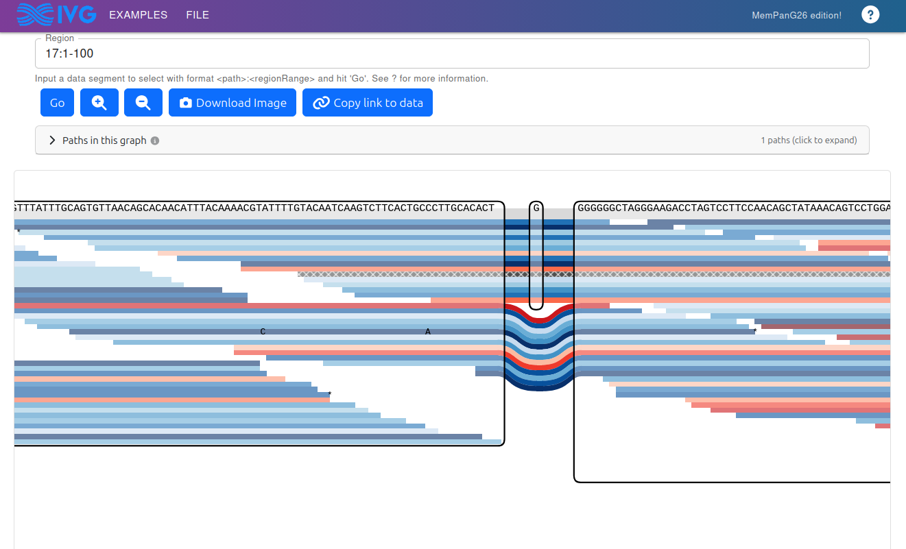

# Sequence Tube Map — MemPanG26 Edition

MemPanG26 Hackathon Team 2 — Colin Diesh &
[Rafeed Rahman Turjya](https://scholar.google.com/citations?user=Vb6tJA0AAAAJ&hl=en)

Updated fork of https://github.com/vgteam/sequenceTubeMap with a variety of
improvements including the ability to upload custom data in the browser

Live demo - https://cmdcolin.github.io/sequenceTubeMap/

## Screenshot



## Quickstart

You can load your own "GBZ.db" files and GAM files at
https://cmdcolin.github.io/sequenceTubeMap

Prepare your files once, then open the demo or run locally.

Convert your graph:

```bash
# .xg → .gbz → .gbz.db
vg gbwt --xg-name input.xg --index-paths --gbz-format -g input.gbz
node scripts/gbz2db.mjs input.gbz input.gbz.db
```

Starting from a GFA (e.g. an HPRC pangenome distribution):

```bash
# .gfa → .gbz → .gbz.db
vg gbwt -G input.gfa --gbz-format -g input.gbz
node scripts/gbz2db.mjs input.gbz input.gbz.db
```

PanSN-named paths (`sample#haplotype#contig`) are queried as
`sample#contig:start-end` in the Region field. Tooltips and the visibility
panel show real sample names (e.g. `HG00438#2#MT`) — see the bundled
"HPRC chrM" example.

### Working with whole-chromosome HPRC graphs

A full HPRC chromosome (e.g. chr20) is ~130 MB as a `.gbz.db` — too big to
bundle in this repo. The bundled "HPRC chr20 (URL-hosted, full PanSN)"
example fetches it from `https://jbrowse.org/demos/ivg/hprc/` instead, so
opening it costs one 130 MB download on first query (cached in memory for
the rest of the session) and you get the full set of real PanSN sample
names in the visibility panel and hover tooltips.

To set up your own URL-hosted example, the direct GFA → GBZ conversion
keeps every sample name intact:

```bash
vg gbwt -G hprc-v1.1-mc-grch38.chr20.gfa --gbz-format -g chr20.gbz
node scripts/gbz2db.mjs chr20.gbz chr20.gbz.db
# Upload chr20.gbz.db to an HTTPS object store with CORS allowed for your
# deployed origin (Access-Control-Allow-Origin response header), then add:
```

```json
{
  "name": "HPRC chr20",
  "tracks": [{ "trackFile": "https://your-bucket/chr20.gbz.db", "trackType": "graph" }],
  "region": "GRCh38#chr20:30000000-30000500",
  "dataType": "built-in"
}
```

#### Why we don't bundle a chr20 slice

`vg chunk -T` (the natural way to extract a small region from a GBZ) samples
haplotypes from the GBWT and re-emits them as anonymous `thread_N` synthetics
— **the original sample names are dropped during chunking**, not stored that
way in the source. Without `-T`, chunking only keeps the reference walks
(CHM13, GRCh38) and drops every non-reference haplotype. Either way the demo
loses the point of showing per-sample tooltips.

`vg gbwt -G` on the *whole-chromosome* GFA preserves all 46 sample names in
the GBWT metadata, which is why the bundled chrM example works. If you want
a smaller region with names intact, slice the GFA itself (e.g. with `odgi
extract -i input.gfa -r "GRCh38#0#chr20:1000000-1100000" -c 20 -o slice.og`,
then `odgi view -i slice.og -g > slice.gfa`) and feed *that* GFA to
`vg gbwt -G`.

Index your reads (optional):

```bash
./scripts/prepare_gam.sh input.gam   # produces input.gam.gai
```

## Navigation

Navigate using `<contig>:<start>-<end>` (e.g. `Circ1:0-1320`). Open the **Paths
in this graph** panel to see available contig names.

## More docs

For WASM build details and caveats: [doc/wasm-build.md](doc/wasm-build.md).

For constructing deep-link URLs: [doc/linking.md](doc/linking.md).

## License

Copyright (c) 2018 Wolfgang Beyer, 2026 Colin Diesh, MIT License.

## Footnote

Claude Code AI was used during this work. Note that the code has significantly
diverged from upstream at this point due to being insane hackathon quality
agentic coding but could be upstreamed piecewise or in whole with effort

## Features added on this fork compared to upstream

- **Serverless/static** — runs entirely in-browser via gbz-base WASM; upload
  `.gbz.db` and `.gam.gai` files directly, nothing leaves your machine
- **Read/node filtering** — right-click reads or nodes to build a staged filter
  set; named read groups with custom palette coloring
- **Node labels** — configurable color palette per node, track legend panel
- **Fit-to-height zoom** preserved across re-renders; performance improvements
  for large graphs
- **Modernized stack** — CRA → custom webpack setup, class → function
  components, React Compiler, full TypeScript, MUI AppBar header, SWR

## Thanks!

Big thanks to the MemPanG26 organizers and group!


https://pangenome.github.io/MemPanG26/
