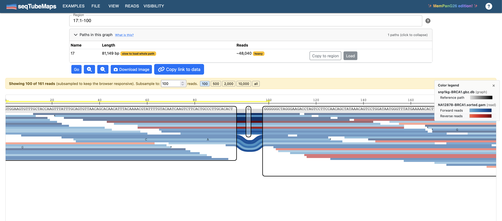
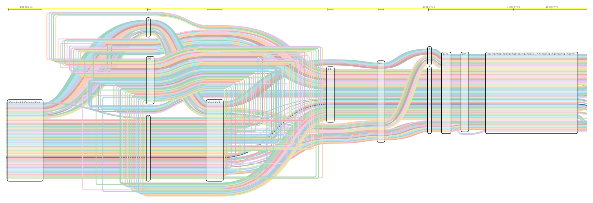
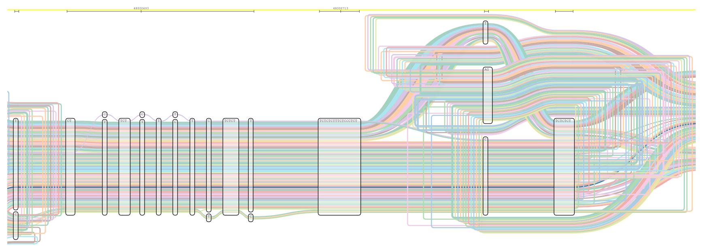
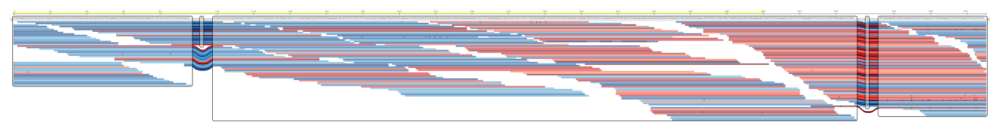

# seqTubeMaps — MemPanG26 Edition

MemPanG26 Hackathon Team 2 — [Colin Diesh](https://github.com/cmdcolin) &
[Rafeed Rahman Turjya](https://scholar.google.com/citations?user=Vb6tJA0AAAAJ&hl=en)
et al.

Fork of https://github.com/vgteam/sequenceTubeMap — adds browser-based uploads,
a modernised React/TypeScript UI, and the ability to send data to the vgteam's
public server.

Live demo — https://cmdcolin.github.io/sequenceTubeMap/

## What it looks like

**A pangenome, not a reference.** 81 haplotypes from 46 HPRC samples through a
CT microsatellite at `chr20:48,000,600-48,001,000`. Every haplotype takes a
distinct route; the 32 allele lengths run 608-678 bp and step by 2 bp, the
repeat unit. Streamed from a 134 MB hosted `.gbz.db` by range requests, with no
server.

The same locus a little to the left, where the haplotypes are still in register
before they fan out:

**Reads over a graph.** 262 GAM alignments across the snp1kg BRCA1 graph, blue
and red for forward and reverse strand:

Every figure here was produced headlessly with `pnpm tubemap-cli` — see
[headless SVG rendering](doc/headless-rendering.md).

## Quickstart

Use **File → Open…** to load your own data. There are three ways in:

|                             | Where the work happens  | Size limit    | Setup needed                  |
| --------------------------- | ----------------------- | ------------- | ----------------------------- |
| **vgteam server** (default) | `api.tubemap.graphs.vg` | 5 MB per file | none                          |
| **In-browser**              | your browser            | none          | one-time `.gbz.db` conversion |
| **Self-hosted server**      | your machine            | none          | Docker or a local checkout    |

The server mode takes `.xg`, `.vg`, and `.gbz` graphs plus `.gam` reads
directly. In-browser mode keeps files on your machine but needs graphs converted
to `.gbz.db` first (`vg` + `gbz-base`); a hosted `.gbz.db` URL is read by HTTP
range requests, so whole-chromosome graphs browse without a download.

→ [Full data loading guide](doc/data.md)

## Navigation

Type `<contig>:<start>-<end>` (e.g. `Circ1:0-1320`) in the region box, or open
**Paths in this graph** to browse the contigs a graph contains. `chr1:1000+500`
and `node:42-55` also work.

## Documentation

**Using it** — [Introduction to sequence tube maps](doc/intro.md) ·
[Loading your own data](doc/data.md) · [Deep-link URLs](doc/linking.md) ·
[Headless SVG rendering](doc/headless-rendering.md)

**Running a server** — [Server data preparation](doc/server-data.md) ·
[Tabix indexes](doc/tabix.md) · [Docker](docker/README.md)

**Under the hood** — [Architecture](doc/architecture.md) ·
[In-browser gbz-base reader](doc/gbz-base.md) ·
[Differences from upstream](doc/differences-from-upstream.md)

**Contributing** — [Development guide](doc/development.md) ·
[Architectural decision records](agent-docs/architectural-decision-records/)

## Thanks

Big thanks to the MemPanG26 organizers and group!

https://pangenome.github.io/MemPanG26/

And the original sequenceTubeMap developers!

---

_Claude Code AI was used during this work._
