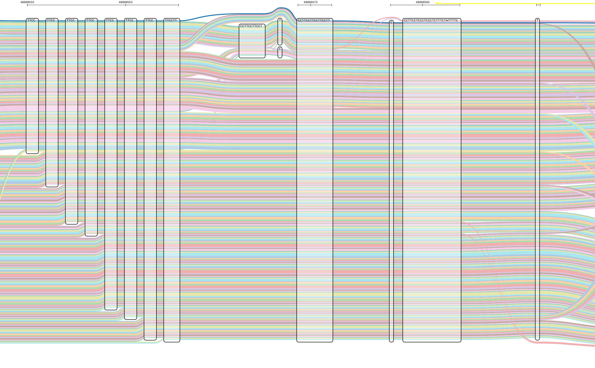
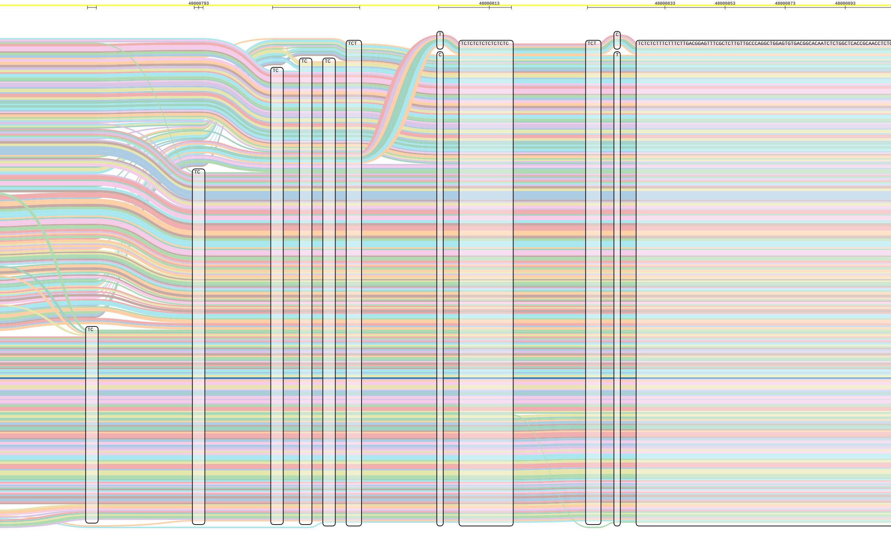
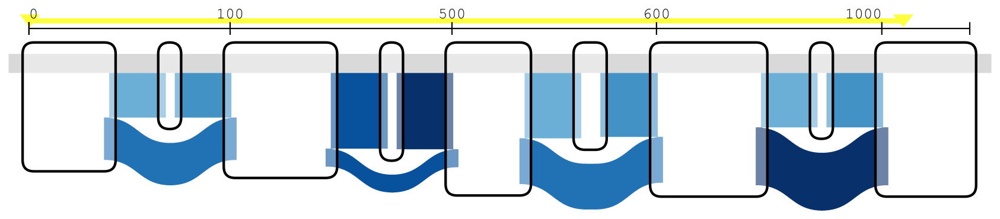

# seqTubeMaps — MemPanG26 Edition

MemPanG26 Hackathon Team 2 — [Colin Diesh](https://github.com/cmdcolin) &
[Rafeed Rahman Turjya](https://scholar.google.com/citations?user=Vb6tJA0AAAAJ&hl=en)
et al.

Fork of https://github.com/vgteam/sequenceTubeMap — adds browser-based uploads,
a modernised React/TypeScript UI, and the ability to send data to the vgteam's
public server.

Live demo — https://cmdcolin.github.io/sequenceTubeMap/

[][demo-brca1]

## What it looks like

Every figure below links to the same data and region in the live demo — the view
is a URL, so any tube map you get to can be shared as one
([every parameter a link can carry](doc/urlparams.md)).

**A pangenome, not a reference.** All 464 haplotypes of
[HPRC release 2.1](https://doi.org/10.64898/2026.07.21.739710) through a CT
microsatellite at `chr20:48,000,600-48,001,000`, on 240 distinct routes: 46
allele lengths from 608 to 680 bp. Each rung of the staircase below is a
haplotype leaving the repeat one copy earlier than its neighbour. Read straight
off HPRC's 10 GB hosted `.gbz.db` by range requests, with no server, and named
from the companion haplotype index beside it — the haplotype through any node is
`HG01243#2#…`, not `unknown#57`.

The same locus about 300 bp to the right, where the haplotypes are back in
register:

[Open chr20:48,000,600-48,001,000 in the live demo][demo-chr20] — both figures
are crops of that one drawing, which the app lays out end to end and lets you
scroll.

**Reads over a graph.** GAM alignments across the snp1kg BRCA1 graph. Red marks
reads whose every node visit is on the reverse strand; a read in mixed
orientation is drawn forward, in blue:

[Open BRCA1 17:1-1000 in the live demo][demo-reads] — the link carries the View
menu's compressed node widths as well as the region. The browser subsamples to
100 reads to stay responsive; the banner above the map raises that.

**The same reads, coarsened.** The Sankey view collapses per-read ribbons into
one band per node-to-node edge, scaled by how many reads traverse it, so
rendering is O(edges) rather than O(reads). Allele balance at each bubble
becomes readable at a glance:

[Open the coarsened view in the live demo][demo-coarsened]

Every figure here was produced headlessly with `pnpm tubemap-cli` — see
[headless SVG rendering](doc/headless-rendering.md).

## Quickstart

Use **File → Open…** to load your own data. There are three ways in:

|                             | Where the work happens  | Size limit    | Setup needed                  |
| --------------------------- | ----------------------- | ------------- | ----------------------------- |
| **vgteam server** (default) | `api.tubemap.graphs.vg` | 5 MB per file | none                          |
| **In-browser**              | your browser            | none          | one-time `.gbz.db` conversion |
| **Self-hosted server**      | your machine            | none          | Docker or a local checkout    |

The server mode takes `.xg`, `.vg`, and `.gbz` graphs plus `.gam` reads
directly. In-browser mode keeps files on your machine but needs graphs converted
to `.gbz.db` first (`vg` + `gbz-base`); a hosted `.gbz.db` URL is read by HTTP
range requests, so a whole-pangenome graph browses without a download — the HPRC
release 2.1 example in the **Examples** menu is 10 GB and never downloaded.

→ [Full data loading guide](doc/data.md)

## Navigation

Type `<contig>:<start>-<end>` (e.g. `Circ1:0-1320`) in the region box, or open
**Paths in this graph** to browse the contigs a graph contains. `chr1:1000+500`
and `node:42-55` also work.

## Documentation

**Using it**

- [Introduction to sequence tube maps](doc/intro.md)
- [Loading your own data](doc/data.md)
- [URL parameters](doc/urlparams.md)
- [Headless SVG rendering](doc/headless-rendering.md)

**Running a server**

- [Server data preparation](doc/server-data.md)
- [Tabix indexes](doc/tabix.md)
- [Docker](docker/README.md)

**Under the hood**

- [Architecture](doc/architecture.md)
- [In-browser gbz-base reader](doc/gbz-base.md)
- [Differences from upstream vgteam/sequenceTubeMap](doc/differences-from-upstream.md)

**Contributing**

- [Development guide](doc/development.md)
- [Architectural decision records](agent-docs/architectural-decision-records/)

## Thanks

Big thanks to the MemPanG26 organizers and group!

https://pangenome.github.io/MemPanG26/

And the original sequenceTubeMap developers!

---

_Claude Code AI was used during this work._

[demo-brca1]:
  https://cmdcolin.github.io/sequenceTubeMap/?name=snp1kg-BRCA1%20(gbz-base)&region=17:1-100
[demo-chr20]:
  https://cmdcolin.github.io/sequenceTubeMap/?name=HPRC%20v2.1%20whole%20genome%20(gbz-base%2C%20URL-hosted)&region=GRCh38%23chr20:48000600-48001000
[demo-reads]:
  https://cmdcolin.github.io/sequenceTubeMap/?name=snp1kg-BRCA1%20(gbz-base)&region=17:1-1000&vis=compressedView
[demo-coarsened]:
  https://cmdcolin.github.io/sequenceTubeMap/?name=snp1kg-BRCA1%20(gbz-base)&region=17:1-1000&vis=compressedView,coarsenedReadView
