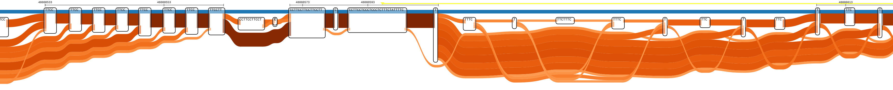
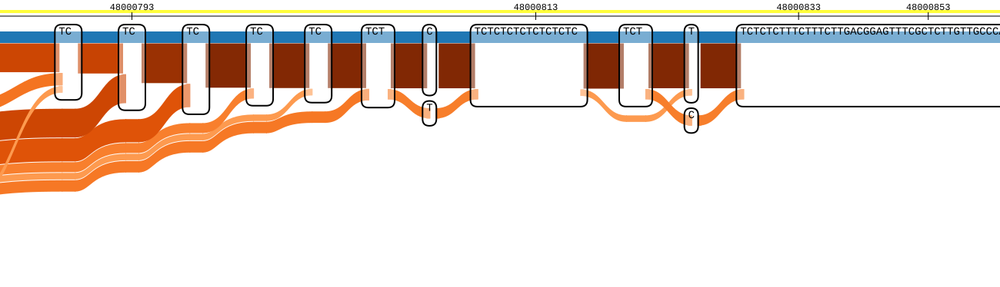
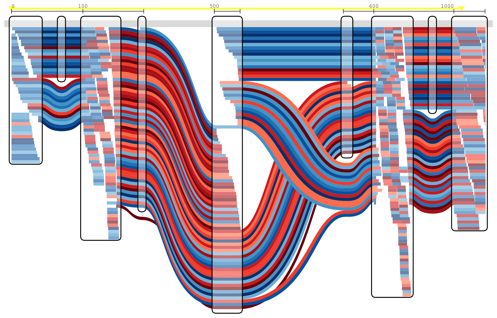
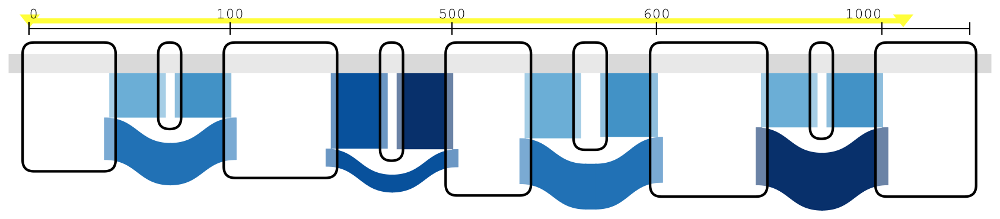
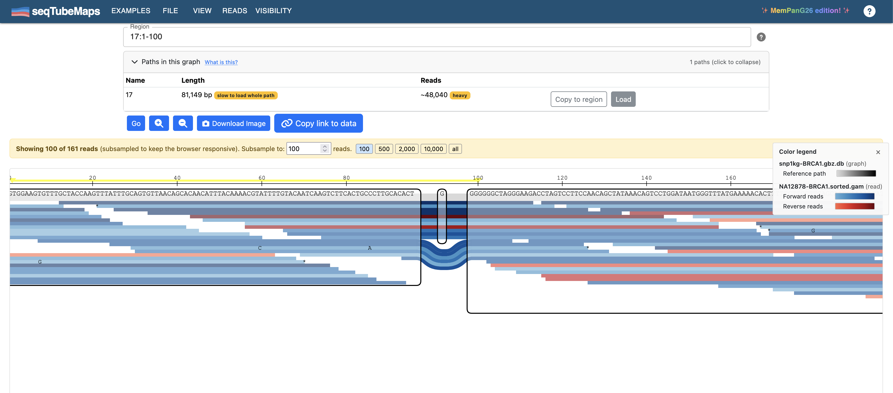

# seqTubeMaps — MemPanG26 Edition

Fork of [vgteam/sequenceTubeMap](https://github.com/vgteam/sequenceTubeMap):
pangenome graphs and reads drawn as tube maps, in the browser. Adds in-browser
`.gbz.db` reading, uploads, and a modernized React/TypeScript UI.

Live demo: https://cmdcolin.github.io/sequenceTubeMap/

MemPanG26 Hackathon Team 2 — [Colin Diesh](https://github.com/cmdcolin) &
[Rafeed Rahman Turjya](https://scholar.google.com/citations?user=Vb6tJA0AAAAJ&hl=en)
et al.

[][demo-chr20]

464 HPRC v2.1 haplotypes at a chr20 CT microsatellite — 46 allele lengths, 240
distinct routes. Read straight from HPRC's 10 GB hosted `.gbz.db` by range
request: no server, no download. Coarsened (Sankey) view bands the haplotypes by
node-to-node edge instead of drawing all 464 as separate lines; haplotypes named
from the companion index (`HG01243#2#…`, not `unknown#57`).

[][demo-chr20]

Same locus, ~170 bp right: haplotypes back in register. Both figures are crops
of one drawing the app lays out end to end and lets you scroll.

## What a tube map shows

A sequence graph encodes related sequences — individuals of one species, or
homologs across species — as shared and diverging paths through nodes.

- **Node** — a stretch of bases; length sets its drawn width.
- **Path** — one sequence, walking through nodes.

Two paths, same three nodes, same sequence:

Where sequences differ, paths part around a bubble:

An inversion: one node traversed both directions, not two nodes:

Graphviz and d3 force layouts draw nodes and edges with no notion of a path or
of orientation. The tube map draws paths as lines on a transit map, with d3.

## Loading data

Use **File → Open…**, or pick a dataset from the **Examples** menu.

|                             | Where the work happens  | Size limit    | Setup needed                  |
| --------------------------- | ----------------------- | ------------- | ----------------------------- |
| **vgteam server** (default) | `api.tubemap.graphs.vg` | 5 MB per file | none                          |
| **In-browser**              | your browser            | none          | one-time `.gbz.db` conversion |
| **Self-hosted server**      | your machine            | none          | Docker or a local checkout    |

Servers take `.xg`, `.vg` and `.gbz` graphs and `.gam` reads directly.
In-browser mode needs a `.gbz.db`; it reads a hosted one by range request, so a
whole-pangenome graph browses with no download. Details:
[doc/data.md](doc/data.md).

## Reads over a graph

GAM alignments over the snp1kg BRCA1 graph. Red: every node visit is
reverse-strand. Mixed-orientation reads draw forward, in blue:

[][demo-reads]

Link carries compressed node widths plus region. Browser subsamples to 100 reads
to stay responsive (banner above the map raises the cap).

Coarsened (Sankey) view: one band per node-to-node edge, scaled by read count —
O(edges), not O(reads). Allele balance at a bubble reads at a glance. The same
view works on a haplotype-only graph with no reads loaded, as in the chr20
figures above: it bands the haplotypes by edge instead.

[][demo-coarsened]

## Navigating and sharing

Region box takes `<contig>:<start>-<end>` (`Circ1:0-1320`), `chr1:1000+500`, or
`node:42-55`. **Paths in this graph** browses a graph's contigs. The URL carries
data, region and view options — any tube map is a shareable link
([params](doc/urlparams.md)).

[][demo-brca1]

## Headless rendering

`pnpm tubemap-cli` renders any source and region to SVG, no browser — made every
figure here but the app screenshot. [Details](doc/headless-rendering.md).

## Docs

- [doc/data.md](doc/data.md) — the three ways to load a graph and its reads,
  building a `.gbz.db`, naming haplotypes, region syntax
- [doc/server.md](doc/server.md) — running the server in Docker or from a
  checkout, its data directory, pre-extracted chunks, tabix indexes
- [doc/urlparams.md](doc/urlparams.md) — every parameter a link can carry
- [doc/headless-rendering.md](doc/headless-rendering.md) — `pnpm tubemap-cli`
  and its options
- [doc/differences-from-upstream.md](doc/differences-from-upstream.md) — what
  changed from vgteam/sequenceTubeMap
- [doc/development.md](doc/development.md) — setup, dev server, checks, build
- [doc/architecture.md](doc/architecture.md) — how a region becomes a drawn tube
  map
- [doc/todo.md](doc/todo.md) — unfinished work

## Thanks

Big thanks to the [MemPanG26](https://pangenome.github.io/MemPanG26/) organizers
and group, and to the original sequenceTubeMap developers!

_Claude Code AI was used during this work._

[demo-brca1]:
  https://cmdcolin.github.io/sequenceTubeMap/?name=snp1kg-BRCA1%20(gbz-base)&region=17:1-100
[demo-chr20]:
  https://cmdcolin.github.io/sequenceTubeMap/?name=HPRC%20v2.1%20whole%20genome%20(gbz-base%2C%20URL-hosted)&region=GRCh38%23chr20:48000600-48001000
[demo-reads]:
  https://cmdcolin.github.io/sequenceTubeMap/?name=snp1kg-BRCA1%20(gbz-base)&region=17:1-1000&vis=compressedView
[demo-coarsened]:
  https://cmdcolin.github.io/sequenceTubeMap/?name=snp1kg-BRCA1%20(gbz-base)&region=17:1-1000&vis=compressedView,coarsenedReadView
