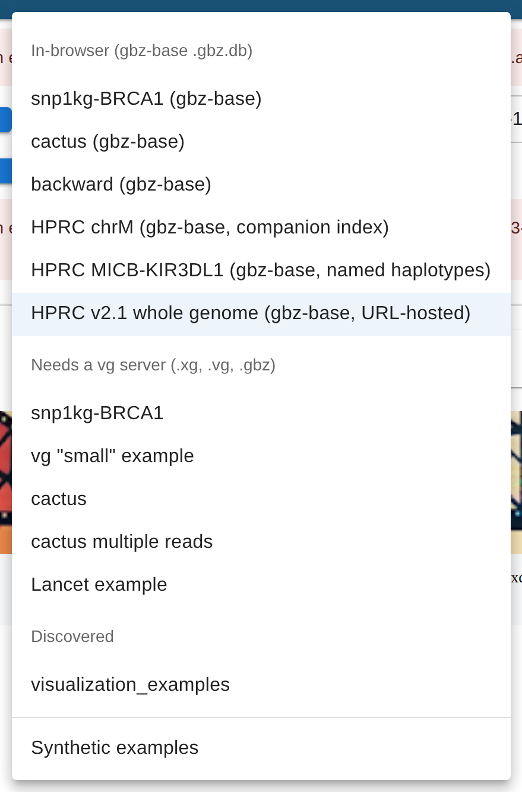
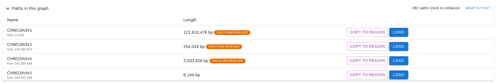
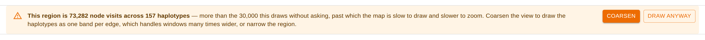
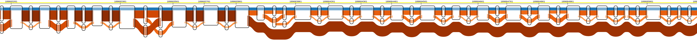
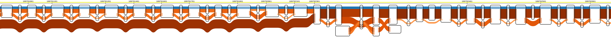

# Loading your own data

There are three ways to get a graph into the tube map. Use **File → Open…** in
the app for the first two.

|                                                     | Where the work happens  | Size limit    | Setup needed                  |
| --------------------------------------------------- | ----------------------- | ------------- | ----------------------------- |
| [vgteam server](#option-1--vgteam-server)           | `api.tubemap.graphs.vg` | 5 MB per file | none                          |
| [In-browser](#option-2--in-browser)                 | your browser            | none          | one-time `.gbz.db` conversion |
| [Self-hosted server](#option-3--self-hosted-server) | your machine            | none          | Docker or a local checkout    |

Running the Express backend yourself unlocks a further set of options — built-in
`Examples` entries, pre-extracted chunks, tabix indexes. Those live in
[server.md](server.md).

---

## Option 1 — vgteam server

The default. Files are uploaded to `api.tubemap.graphs.vg` (run by the vgteam),
processed by `vg` server-side, and deleted after 24 hours. **5 MB limit per
file.**

**Accepted formats**

| Track     | Formats                            |
| --------- | ---------------------------------- |
| Graph     | `.xg`, `.vg`, `.gbz`, `.pg`, `.hg` |
| Reads     | `.gam`                             |
| Haplotype | `.gbwt`                            |

A `.gam.gai` may be included but is ignored — the server sorts and indexes the
`.gam` itself. `.gaf` is not accepted here: it has to be sorted and
tabix-indexed beforehand, which the upload route cannot do, so a `.gaf` read
track only works when it is already mounted in a server's data directory.

**Prepare your graph** (if you don't have an `.xg` already):

```bash
# From a GFA (e.g. HPRC pangenome)
vg convert -g pangenome.gfa | vg index -x graph.xg -

# From a VG
vg index -x graph.xg graph.vg
```

Drop the graph and read files in the dialog and click **Upload & use**.

---

## Option 2 — In-browser

Everything runs in your browser — no server, no upload. Files never leave your
machine and there is no size limit. The browser reads `.gbz.db` files with
[`@gmod/gbz-base`](https://github.com/GMOD/gbz-base-js), a pure TypeScript port
of the `gbz-base query` subgraph queries that walks the SQLite b-trees directly
and fetches only the pages a query touches.

**Accepted formats**

| Track | Formats                                                          |
| ----- | ---------------------------------------------------------------- |
| Graph | `.gbz.db` or `.db`                                               |
| Reads | `.gam` (unsorted) or `.sorted.gam` + `.sorted.gam.gai` (indexed) |

### Converting a graph to `.gbz.db`

This needs [`gbz-base`](https://github.com/jltsiren/gbz-base)
(`cargo install --git https://github.com/jltsiren/gbz-base`), and
[`vg`](https://github.com/vgteam/vg) (`mamba install -c bioconda vg`) if you are
not starting from a `.gbz`:

```bash
# from an .xg (or .vg): build a GBZ with embedded paths
vg gbwt --xg-name input.xg --index-paths --gbz-format -g input.gbz
# from a GFA (keeps PanSN sample names intact)
vg gbwt -G input.gfa --gbz-format -g input.gbz

# GBZ -> SQLite database
gbz-base construct input.gbz            # writes input.gbz.db
gbz-base construct --output other.db --overwrite input.gbz
```

Releases up to 0.5.1 call the binary `gbz2db` instead of `gbz-base construct`.
`scripts/rebuild-bundled-dbs.sh` runs the conversion over every `.gbz` under
`exampleData/`.

The app recognizes any graph track ending in `.db`, not only `.gbz.db`, since
`--output` will call the database whatever you like. The reader refuses a file
that turns out not to be a gbz-base database when it opens it, not when it is
named.

The reader accepts exactly one schema tag, `GBZ-base version 4`
(`SCHEMA_VERSION` in `@gmod/gbz-base`), which every `gbz-base` release from
0.5.0 on writes. It refuses anything else, older or newer, with a
`SchemaVersionError` rather than reading it on a guess, so a future upstream
version 5 would need a matching reader release first.

### Naming haplotypes (optional)

Upstream gbz-base names only the query path, so by default the other haplotypes
are reported as `unknown#N#contig`. The Rust tool `gbz-haplotype-index` writes a
companion haplotype index (tables `HaplotypeSamples`, `HaplotypeLengths`,
`HaplotypeAnchors`) beside the database; with it, every haplotype through a
window is reported under its real `sample#haplotype#contig` name, and the paths
panel shows exact lengths. The tool never touches the database, which stays
exactly what `gbz-base construct` wrote. What the tables hold is in the
[gbz-base docs](https://github.com/GMOD/gbz-base-js/blob/main/docs/haplotype-index.md).

```bash
cargo install gbz-haplotype-index
gbz-haplotype-index graph.gbz graph.gbz.db graph.haplotype-index.db
# or, without the .gbz at hand:
gbz-haplotype-index --from-db graph.gbz.db graph.haplotype-index.db
```

Naming `graph.gbz.db` between the GBZ and the index checks that the two match.
The tool refuses to replace an existing index without `--overwrite`.

Build cost scales with total path length, not graph size: the full HPRC v2.1
graph (5.5 GB GBZ, 53,150 paths, 1,305 Gbp walked) takes about 13 minutes on 24
cores and yields a 7.9 GB companion. The bundled examples take seconds.

`--interval` (default 4096 bp) is the size/latency knob: it sets how far apart
the samples along each path are, so halving it roughly doubles the table and
halves the `lf()` walk needed to name a path that missed every sample. Small
graphs like the bundled examples are fine at the default; the published HPRC
v2.1 index was built at 16384. `--anchor-spacing` (default 131072 bp) does the
same for `HaplotypeAnchors`.

gbz-base 3.0 reads the index only from a companion. A database built by an older
`gbz-haplotype-index` with the tables inside it now reports `unknown#N` like any
other; `--from-db` builds its companion without the GBZ. The bundled
`exampleData/hprc-chrM.gbz.db` (110 kB) and `exampleData/micb-kir3dl1.gbz.db`
(an HPRC slice from the package's test data) each have a `.haplotype-index.db`
beside them, which `scripts/rebuild-bundled-dbs.sh` regenerates.

#### Pointing a track at a companion index

The graph track names the companion beside the database:

```json
{
  "trackFile": "https://example.org/graph.gbz.db",
  "haplotypeIndexFile": "https://example.org/graph.haplotype-index.db",
  "trackType": "graph"
}
```

`haplotypeIndexFile` works wherever a graph track is spelled out for the
in-browser backend — `DATA_SOURCES` in `src/config.json`, or `tracksJson=` in a
link — and the browser reads it by range request like the database itself. Only
that backend uses it: a vg server ignores it, since the graph it chunks carries
the path names already.

The published HPRC release 2.1 graph shows why the index is a file of its own.
HPRC hosts the 10 GB database, JBrowse hosts the 7.9 GB companion, and the
bundled "HPRC v2.1 whole genome" example reads both:

```json
{
  "trackFile": "https://s3-us-west-2.amazonaws.com/human-pangenomics/pangenomes/freeze/release2/minigraph-cactus/v2.1/hprc-v2.1-mc-grch38/hprc-v2.1-mc-grch38.gbz.db",
  "haplotypeIndexFile": "https://jbrowse.org/demos/hprc/hprc-v2.1-mc-grch38.haplotype-index.anchored.db",
  "trackType": "graph"
}
```

Measured against those two files from a home connection, 500 bp inside _LPA_'s
KIV-2 array (`GRCh38#chr6:160620000-160620500`, the example's default region): 2
s, 15 range requests, 1 MB, for 57 nodes and 23 distinct haplotype walks — named
`HG03942#2#CM088404.1` rather than `unknown#2`.

The paths panel is the other reason to name the index. It asks for a length per
indexed path, and the companion answers that out of `HaplotypeLengths` instead
of walking the graph to the end of each one: the release 2.1 graph's 292 indexed
paths cost 2.3 s and 3.6 MB with the companion open, and 6 s and 41 MB without
it.

### Indexing reads for region queries

Drop an unsorted `.gam` to scan every alignment, or sort and index it so only
the blocks overlapping the region are read:

```bash
vg gamsort input.gam -i input.sorted.gam.gai > input.sorted.gam
```

Drop both `.sorted.gam` and `.sorted.gam.gai` into the dialog together. A
`.sorted.gam` dropped again on its own is read unindexed, since the index
dropped earlier describes the earlier file.

### Loading

In the dialog click **Switch to in-browser →**, drop your files, and click
**Load files**. The browser reads an uploaded file in place from its `File`
object, and it never leaves your machine.

A `.gbz.db` hosted on an HTTPS server with CORS (`Access-Control-Allow-Origin`)
and range support, which S3 and CloudFront provide, can instead be given as a
track URL. The browser reads it by range requests rather than downloading it, so
a whole-pangenome graph works without pulling the whole file. The bundled **HPRC
v2.1 whole genome** example is exactly that: 10 GB on HPRC's S3, where a 500 bp
window costs 15 requests and a megabyte. Bigger windows cost proportionally
more; the reader's README has numbers for MHC- and LPA-scale queries.

### Which bundled examples read in the browser

The **Examples** menu groups its entries by backend, and a `(gbz-base)` in the
name says the same thing: that graph is a `.gbz.db` the browser reads itself.



That is the menu with a server configured. In-browser mode shows the first group
alone, since it is the only one it can open — `Discovered` is whatever
`manifest.json` files the server's data directory holds
([server.md](server.md)). The entries that read a `.gbz.db`, from `DATA_SOURCES`
in `src/config.json`:

| Example                                        | Graph                                | Haplotype names                                                                |
| ---------------------------------------------- | ------------------------------------ | ------------------------------------------------------------------------------ |
| snp1kg-BRCA1 (gbz-base)                        | bundled, with a `.gam` read track    | `_gbwt_ref` paths, no haplotypes                                               |
| cactus (gbz-base)                              | bundled, with a `.gam` read track    | `_gbwt_ref` paths, no haplotypes                                               |
| backward (gbz-base)                            | bundled, `fwd` and `rev` paths       | `_gbwt_ref` paths, no haplotypes                                               |
| HPRC chrM (gbz-base, companion index)          | bundled, PanSN sample names          | real, from a bundled [companion index](#pointing-a-track-at-a-companion-index) |
| HPRC MICB-KIR3DL1 (gbz-base, named haplotypes) | bundled, an HPRC slice               | real, from a bundled [companion index](#pointing-a-track-at-a-companion-index) |
| HPRC v2.1 whole genome (gbz-base, URL-hosted)  | hosted, 10 GB, read by range request | real, from the [companion index](#pointing-a-track-at-a-companion-index)       |

Everything else in the menu — `snp1kg-BRCA1`, `vg "small" example`, `cactus`,
`cactus multiple reads`, `Lancet example` — is an `.xg`/`.vg`/`.gbz` graph that
`vg chunk` has to cut, so it needs the vgteam server or a self-hosted one and
the in-browser mode hides it.

---

## Option 3 — Self-hosted server

Run the full `vg` + Express server yourself, for files over the 5 MB cap or for
data you don't want to upload.

```bash
docker run -it -p 3210:3000 -v $(pwd):/data quay.io/jmonlong/sequencetubemap:vg1.74.1
```

Open http://localhost:3210 and set the backend URL under **Backend
configuration** at the bottom of the page. [server.md](server.md) covers SSH
tunnelling, building the image, and what the data directory can hold once the
server is running.

---

## Finding contig names

Open **Paths in this graph** in the sidebar to browse the paths a graph
contains. In the browser, with an uploaded graph and a read file of up to 32 MB,
it also counts the reads on each path; for a hosted file it leaves the Reads
column out, since counting means downloading the whole GAM. Region syntax:

|                  | Example          |
| ---------------- | ---------------- |
| Coordinate range | `chr1:1000-2000` |
| Start + length   | `chr1:1000+500`  |
| Node ID range    | `node:42-55`     |
| Node + context   | `node:42+5`      |

A node region is cut the way `vg chunk` cuts it, by either backend: `node:42-55`
is the nodes with those ids and everything within 20 edges of them, and
`node:42+5` is node 42 and everything within five. The browser refuses a node
region that spans more than 10,000 ids or takes in more than 10,000 nodes, since
each can be a range request. With no path to anchor it, a node region has no
ruler, and in the browser its walks are named only when the graph has a
[companion index](#naming-haplotypes-optional).

### Region syntax for PanSN graphs

`<contig>:<start>-<end>` queries the generic (`_gbwt_ref`) path;
`<sample>#<contig>:<start>-<end>` a PanSN reference path (haplotype 0);
`<sample>#<haplotype>#<contig>:<start>-<end>` a specific haplotype. Only paths
the database indexed for random access (generic paths and the samples in the
GBWT `reference_samples` tag) can be queried, whichever form is used.

### Fragmented contigs

A graph that splits a contig into fragments lists one row per fragment, all
under the contig's name, so each row also carries the offset it starts at —
which is what **Load** and **Copy to region** put in the Region field. HPRC
release 2.1 does this heavily: 292 indexed paths under 219 distinct names.



## How wide a region will draw

A tube map draws every haplotype through the window, and the cost of that is the
number of nodes those haplotypes visit between them rather than the number of
bases or nodes on their own: one node that 464 haplotypes walk is 464 ribbon
segments. On a pangenome graph it climbs fast, and superlinearly, because a
wider window is also a window more haplotypes diverge in. Measured on HPRC
release 2.1, which carries 464:

| Region                                     | Nodes | Distinct walks | Node visits |
| ------------------------------------------ | ----: | -------------: | ----------: |
| `GRCh38#chr6:160620000-160620500` (500 bp) |    57 |             23 |         874 |
| `GRCh38#chr20:48000600-48001000` (400 bp)  |   104 |            240 |      14,518 |
| `GRCh38#chr6:31500000-31502000` (2 kb)     |   129 |             25 |       2,146 |
| `GRCh38#chr6:31500000-31510000` (10 kb)    |   712 |            157 |      73,282 |
| `GRCh38#chr6:31500000-31550000` (50 kb)    | 2,498 |            300 |     495,391 |
| `GRCh38#chr6:31500000-31650000` (150 kb)   | 6,651 |            450 |   1,975,561 |

Above 30,000 node visits the app stops before drawing and says what the region
came to:



Measured in Chrome, the 10 kb row draws in a second but then takes 400 ms per
zoom step, and the 50 kb row takes 10 s to draw. **Draw anyway** is there when
you mean it.

**Coarsen** is the better answer on a graph with no reads loaded: the coarsened
view draws one band per node-to-node edge instead of one ribbon per visit, so it
gets a cap of 1,000,000 visits instead. Coarsened, the 10 kb row draws in 0.6 s
and zooms at 30 ms a step; the 50 kb row draws in 1.3 s and zooms at 85 ms a
step; the 150 kb row takes 4 s and 300 ms or more a step, so it stays refused.

### How wide a region will load

The render cap counts what arrived, and past a point the fetch is the problem:
in the browser the same MHC locus is 76 MB of JSON at 150 kb and 221 MB at 500
kb, and 1 Mb is more than a tab holds. So a region wider than 200 kb is held
before its fetch, with a notice and a **Load anyway** button, whether it was
typed or arrived in a shared link. Width says little about size on its own (a
sparse graph loads far wider windows), so this is the only guard that asks
rather than refuses. Two backstops sit behind it: the browser stops reading a
path region at 50,000 nodes, before it has read a haplotype, and says how wide a
region would have fit; and the vgteam server refuses a region wider than its
`maxRegionBp` (2 Mb by default, see [request limits](server.md#request-limits)).

A coarsened window wide enough to hold a structural variant is still far wider
than a page, so a figure of one is best cropped to its breakpoints. Across the
30 kb window `GRCh38#chr1:109675000-109705000`, about 70% of the HPRC v2.1
haplotypes skip GSTM1, the common 18 kb deletion. The dark band leaves the
reference near 109,683,900, where a paler band of the haplotypes that keep the
gene carries on through it:



The same band rejoins near 109,702,400:



The whole window lays out 94,708 by 244 units even with compressed node widths.
The crops come from one render, reframed by its viewBox since `rsvg-convert`
cannot rasterize anything that wide:

```bash
pnpm tubemap-cli --source 'HPRC v2.1 whole genome (gbz-base, URL-hosted)' \
                 --region 'GRCh38#chr1:109675000-109705000' \
                 --coarsened --compressed --out gstm1.svg
sed '0,/viewBox="[^"]*"/s//viewBox="52000 -20 3700 245"/' gstm1.svg |
  rsvg-convert -b white -o doc/images/hprc-v2.1-gstm1-deletion-start.png
sed '0,/viewBox="[^"]*"/s//viewBox="83900 -20 3700 245"/' gstm1.svg |
  rsvg-convert -b white -o doc/images/hprc-v2.1-gstm1-deletion-end.png
```

The cap resets with each new region, and `pnpm tubemap-cli` ignores it.

To see the shape of a window too wide to draw, **View → Open in BandageJS**
shows it as a force-directed graph, which costs nodes rather than node visits.

Reads are capped separately and subsampled rather than refused, since dropping
reads still leaves a true picture of the graph; the banner above the map says
how many of them are drawn.

## Graph requirements

A graph must contain haplotype or path information — only nodes covered by at
least one haplotype or path are drawn, so a graph with none renders nothing.
