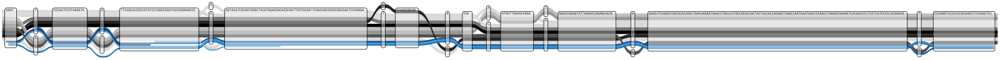
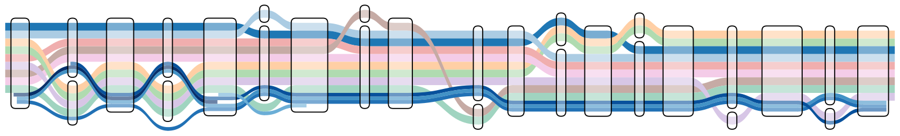
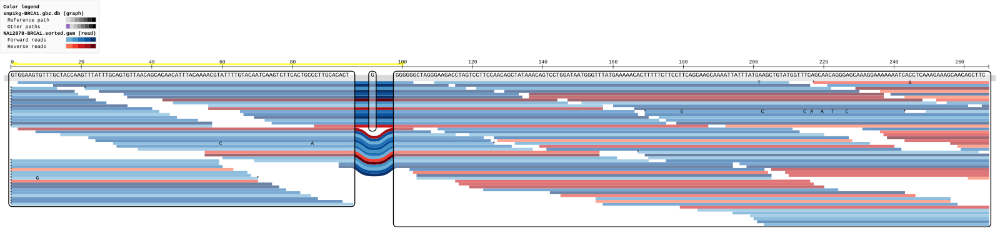
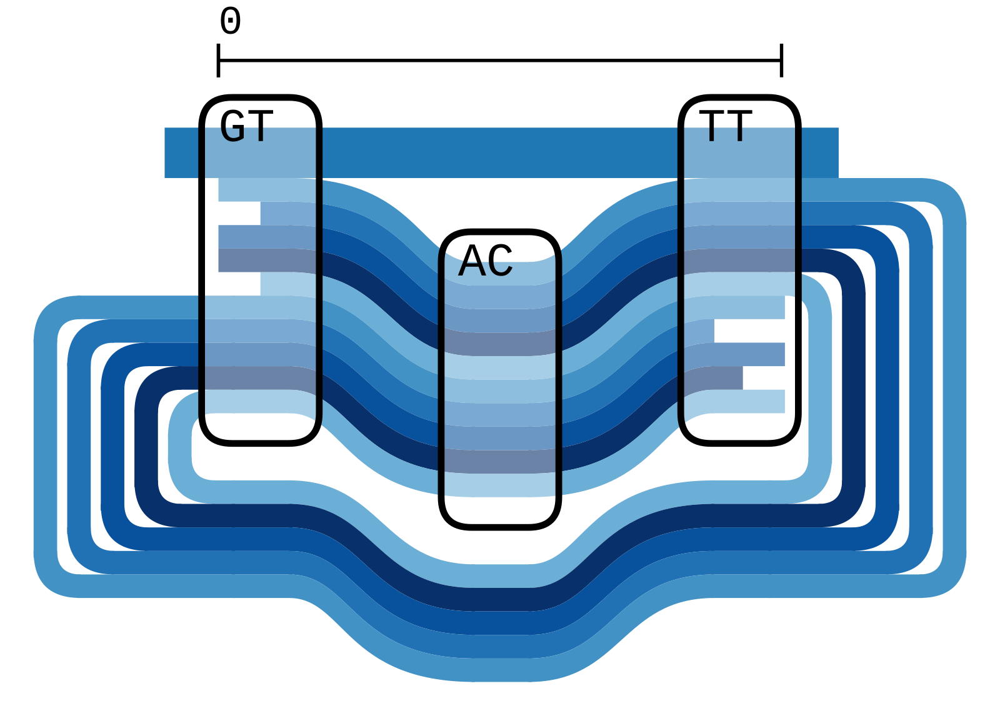
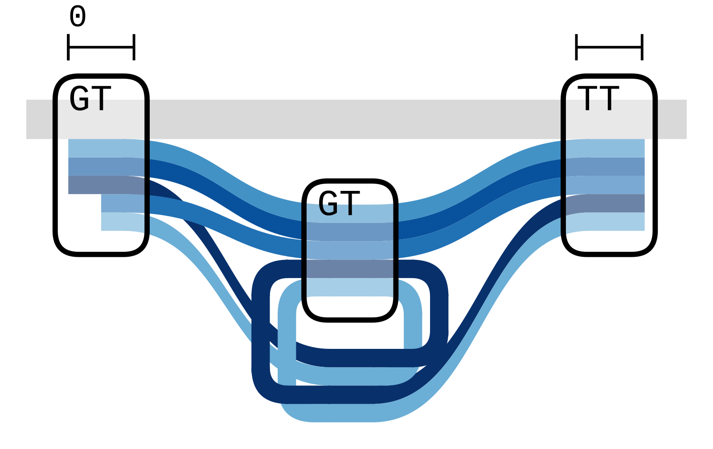
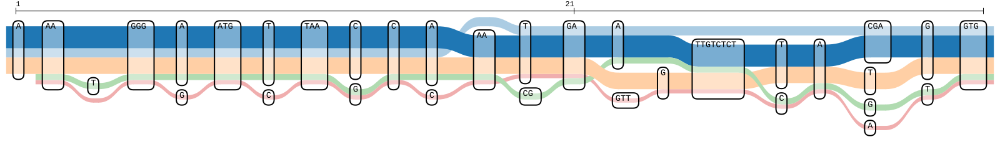

# Headless rendering (CLI)

The same d3 layout the web UI uses can also run under Node + jsdom and emit a
static SVG — useful for scripting, headless servers, or pasting a tube map into
a paper without a browser screenshot.

```bash
# bundled demo data (1–9)
pnpm tubemap-cli --example 6 --out demo6.svg

# real data via the in-browser API (any source from src/config.json)
pnpm tubemap-cli --source 'snp1kg-BRCA1 (WASM-compatible)' \
                 --out brca1.svg --width 3000

# region override
pnpm tubemap-cli --source 'snp1kg-BRCA1 (WASM-compatible)' \
                 --region 17:1-200 --out brca1-zoom.svg
```

## Sizing

`--width`/`--height` set the viewport the map is laid out in, which is what
decides how far the drawing is scaled down to fit. The exported `viewBox` is
then cropped to the drawing itself, so nothing is clipped and there is no dead
space around it. Pass `--viewport` to export the whole canvas instead.

## View options

`--compressed`, `--no-reads`, `--node-labels`, `--coarsened` and `--mapq N`
mirror the app's View menu. `--compressed` is the one to reach for on a graph
whose nodes hold long sequences: node width becomes logarithmic in sequence
length, which is often the difference between a legible figure and a drawing
tens of thousands of units wide.

Example 6 at natural node widths is 4376 units across
([SVG](tubemap-cli-samples/demo-example-6.svg)):



The same data with `--compressed` is 1725 across, and readable at the width a
page actually gives it
([SVG](tubemap-cli-samples/demo-example-6-compressed.svg)):



## Reads

Unlike the browser, which subsamples to 100 reads by default to stay responsive,
the CLI draws every read in the region. `--read-limit N` applies the same even
subsampling when a high-coverage region would otherwise produce an unusably
large SVG:

```bash
pnpm tubemap-cli --source 'snp1kg-BRCA1 (WASM-compatible)' \
                 --region 17:1-300 --read-limit 100 --out brca1-sampled.svg
```

## Sample output

Everything below was produced by the commands above and lives in
[tubemap-cli-samples/](tubemap-cli-samples/), SVG alongside PNG.

`--source 'snp1kg-BRCA1 (WASM-compatible)' --width 3000`
([SVG](tubemap-cli-samples/snp1kg-BRCA1.svg))



`--example 8` — a cyclic graph, whose loops are drawn outside the node bounds
([SVG](tubemap-cli-samples/demo-example-8.svg))



`--example 7` — mixed forward and reverse alignments
([SVG](tubemap-cli-samples/demo-example-7.svg))



`--example 1` — haplotypes only, no reads
([SVG](tubemap-cli-samples/demo-example-1.svg))



The remaining demo datasets render the same way: examples
[2](tubemap-cli-samples/demo-example-2.png),
[3](tubemap-cli-samples/demo-example-3.png),
[4](tubemap-cli-samples/demo-example-4.png),
[5](tubemap-cli-samples/demo-example-5.png) and
[9](tubemap-cli-samples/demo-example-9.png).

A render whose layout produced non-finite coordinates prints
`warning: N shape(s) have non-finite coordinates and will not appear`. Those
shapes are missing from the picture, so treat the figure as incomplete rather
than shipping it.

Caveat: interactive features (zoom, context menus) are inert in headless mode.
