# Headless rendering (CLI)

The same d3 layout the web UI uses can also run under Node + jsdom and emit a
static SVG — useful for scripting, headless servers, or pasting a tube map into
a paper without a browser screenshot.

```bash
# your own files: a .gbz.db, a region, and any number of .gam read files
pnpm tubemap-cli --graph my.gbz.db --reads my.gam --region chr1:1-500 \
                 --out mine.svg

# whatever a link from the app describes
pnpm tubemap-cli --url 'https://cmdcolin.github.io/sequenceTubeMap/?name=snp1kg-BRCA1%20(gbz-base)&region=17:1-1000' \
                 --out brca1.svg

# a source from src/config.json by name, with the region it names or your own
pnpm tubemap-cli --source 'snp1kg-BRCA1 (gbz-base)' --out brca1.svg
pnpm tubemap-cli --source 'snp1kg-BRCA1 (gbz-base)' \
                 --region 17:1-200 --out brca1-zoom.svg

# bundled demo data (1–9)
pnpm tubemap-cli --example 6 --out demo6.svg
```

Node runs `scripts/tubemap-cli.ts` and the `src/` modules it pulls in directly,
stripping the types rather than bundling first. Strip-only mode erases types but
does not rewrite syntax, so `tsconfig.json` sets `erasableSyntaxOnly` — enums,
namespaces and constructor parameter properties would break this entry point
even though the Vite build accepts them.

## Your own files

`--graph` takes a `.gbz.db`, local or a URL, and `--region` says where in it to
look. `--reads` adds a GAM read track and can be repeated; a
[`.gai` index](data.md#indexing-reads-for-region-queries) beside the GAM is
picked up, so only the blocks the region touches are read. `--haplotype-index`
names the graph's
[companion index](data.md#pointing-a-track-at-a-companion-index), which is where
haplotypes get their real names. Local paths resolve against the working
directory.

Those are the only formats the renderer reads, so a `.vg`, `.xg` or `.gbz` graph
needs [converting to `.gbz.db`](data.md#converting-a-graph-to-gbzdb) first, and
a GAF converting to GAM.

## Rendering a link

`--url` takes what the app's **Copy link** button produces, or the address bar
itself, and draws it: the region, the tracks, the colors and the View menu
settings the link carries are the ones the app would have shown
([what a link can say](urlparams.md)). `--region` and the view options below
override it, so a link is a starting point rather than the whole command.

Two things a link does not carry into a headless render. Its data has to be
readable by the in-browser backend, which means a `.gbz.db` graph — a link to a
`.vg`/`.xg`/`.gbz` source is refused rather than half-drawn. And the browser
subsamples reads where the CLI does not, so a dense region draws every read here
unless `--read-limit` says otherwise.

## Sizing

The exported `viewBox` is cropped to the drawing itself, at natural scale, so
nothing is clipped and there is no dead space around it. Two renders of the same
data and view options are the same file whatever `--width`/`--height` say, and
the same file the app's **Download Image** button saves.

`--width`/`--height` size the viewport the map is laid out in, which decides the
zoom the app would open it at. That only reaches the output through
`--viewport`, which exports the whole canvas at that zoom — what the app would
show — rather than the cropped figure.

## View options

Every option in the app's View menu has a flag: `--compressed`, `--no-reads`,
`--no-soft-clips`, `--no-merge-nodes`, `--node-labels`, `--transparent-nodes`,
`--coarsened`, `--banded-haplotypes`, `--ignore-strand`, `--color-by-mapq`,
`--alpha-by-mapq`, `--mapq N` and `--facet-by F` — `--help` lists them, from the
same table that reads them, so the two cannot drift apart. The mapping-quality
flags only show up when the reads actually differ in mapping quality.

`--ignore-strand` is quiet on all nine bundled `--example` datasets, which is
those datasets rather than the flag. What it moves in the normal view is reads
the renderer marked `is_reverse`, and it marks a read that way only when _every_
node visit is reversed — a mixed-orientation read is drawn as if forward. None
of the `--example` datasets contain a wholly reversed read, but plenty of the
bundled alignment data does: on snp1kg-BRCA1 at `17:1-400` the flag moves all
118 reverse-strand reads out of the red auxiliary palette and into the blue main
one.

Under `--coarsened` the flag rarely changes anything. The layout turns reads,
and haplotypes stored back to front, around before it bands them, so both
traversals of an edge have usually collapsed into one band already. What the
flag still moves is a band that runs against the reference, such as haplotypes
through an inversion: it merges that band into the forward one and drops its
purple.

`--coarsened` on a graph with no reads loaded coarsens the haplotypes instead:
the reference keeps its own lane (so the ruler still works), and every other
haplotype collapses into one band per node-to-node edge, the same way reads do.
A graph with hundreds of haplotypes otherwise draws as one lane per haplotype —
solid color soup at that count — so this is the flag to reach for there too; see
[Hosted graphs](#hosted-graphs) below for a worked example.

`--banded-haplotypes` bands the haplotypes that way with reads loaded too, and
stacks the reads under the bands: one by one, or banded as well under
`--coarsened`. The legend keys the haplotype bands by their share and the reads
by whatever colors them.

`--facet-by read_group` (or `sample_name`) draws the graph once per read group
or sample, stacked top to bottom under a label naming the group and its read
count, with each panel holding only that group's reads. Every panel takes the
same node positions, so a node lines up down the stack and a branch one group's
reads take and another's skip shows at a glance. The ruler draws once, at the
top, and one legend keys every panel, since a track keeps its color in every
panel it appears in. `none` turns it off.

The figures below draw `exampleData/hprc-chrM-3samples.sorted.gam`, reads
simulated from the chrM haplotypes of three HPRC samples (no bundled alignment
file carries more than one read group or sample), over the first 650 bp of
`hprc-chrM.gbz.db` with the haplotypes banded. `scripts/make-facet-fixture.sh`
rebuilds the reads and `scripts/make-facet-figures.sh` the figures.

Split by sample, HG02886's reads leave the reference for the C alleles at chrM
146 and 152, where HG00438's and HG00735's stay on T:

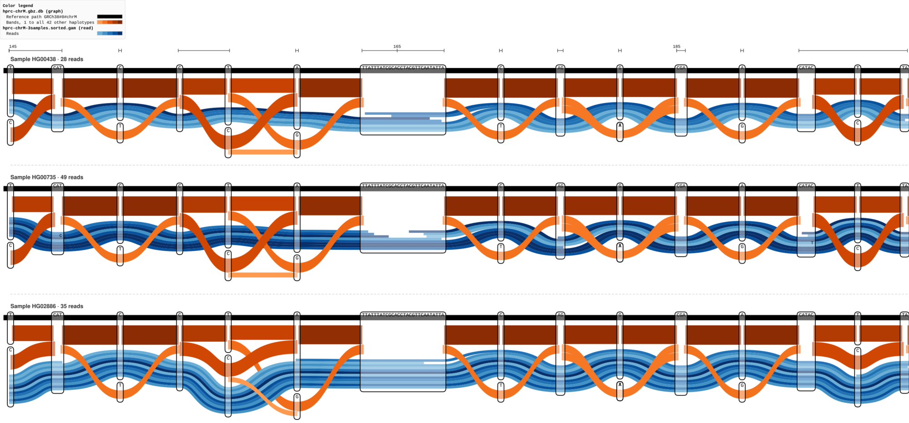

Under `--coarsened` each panel bands its own reads, so the same split reads as
one band per sample and edge:

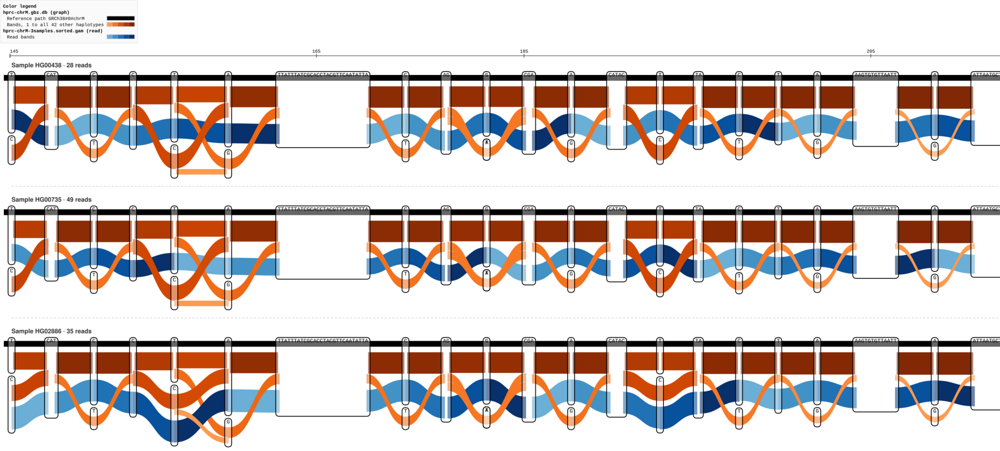

Split by read group, with `--compressed`, the two lanes of each sample agree
with each other and differ from the other samples' lanes in the same places:

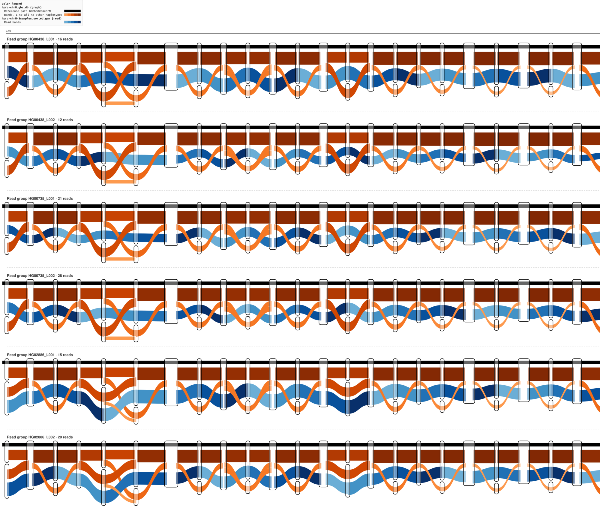

`--compressed` is the one to reach for whenever a figure comes out unreadably
wide. Node width scales with sequence length, so any region spanning many bases
lays out far wider than tall and the detail disappears; making width logarithmic
pulls it back. snp1kg-BRCA1 at `17:1-1000` goes from 10046 units across to 1099
at the same height, and it rescues a dense read pileup just as much as a graph
with long nodes.

Example 6 at natural node widths is 4221 units across
([SVG](tubemap-cli-samples/demo-example-6.svg)):

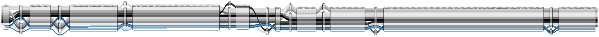

The same data with `--compressed` is 1725 across, and readable at the width a
page actually gives it
([SVG](tubemap-cli-samples/demo-example-6-compressed.svg)):

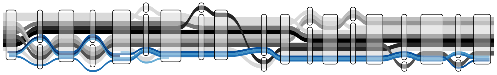

### Haplotypes by sample

`--facet-by haplotype_sample` splits the haplotypes instead, by the sample in
their [PanSN](https://github.com/pangenome/PanSN-spec) names
(`sample#haplotype#contig`): one panel per sample, labelled with the number of
that sample's haplotypes, each holding the reference and those haplotypes. The
haplotypes whose names carry no sample (`unknown#3#chrM`, `thread_7`, `Track A`)
share a panel labelled _No PanSN sample_ after the samples. Every panel keeps
the topology's node order and x, so a node a sample's haplotypes skip stays in
place as an empty outline, and a private allele shows as the one panel whose
haplotypes enter it.

The reads draw in a last panel of their own, beside the reference alone and
labelled with their count, rather than repeating under every sample: they come
from whatever was sequenced, not from the samples the haplotypes name. Reads and
haplotypes can't both be faceted at once, so the View menu offers the four
choices (none, read group, read sample, haplotype sample) as one.

The gbz-base backend usually collapses identical haplotypes into one walk named
for whichever sorted first, which would file the rest under the wrong sample, so
a haplotype facet fetches every haplotype under its own name. On a hosted graph
with hundreds of haplotypes that means hundreds of tubes to lay out.

Under `--banded-haplotypes` each panel bands only its own haplotypes, and a
band's share is of the panel's haplotypes, not the whole cohort's: for a diploid
sample a band at 50% is a heterozygous allele and one at 100% homozygous. The
legend says so when the panels band different totals.

The three figures below draw real HPRC haplotypes from the bundled graphs, and
`scripts/make-facet-figures.sh` regenerates them. Each crops a stack too tall to
print whole.

MICB-KIR3DL1 at `GRCh38#chr6:31500700-31500949`, the first seven of 45 sample
panels, each haplotype in its own color and the reference in grey. Where both of
a sample's haplotypes leave the reference, as HG00733's do, the reference is the
tube that bends:

```sh
pnpm tubemap-cli --compressed --legend --out micb.svg --url '?tracksJson=[{"trackFile":"exampleData/micb-kir3dl1.gbz.db","haplotypeIndexFile":"exampleData/micb-kir3dl1.haplotype-index.db","trackType":"graph","trackColorSettings":{"mainPalette":"greys","auxPalette":"plainColors"}}]&region=GRCh38%23chr6:31500700-31500949&facet=haplotype_sample'
```

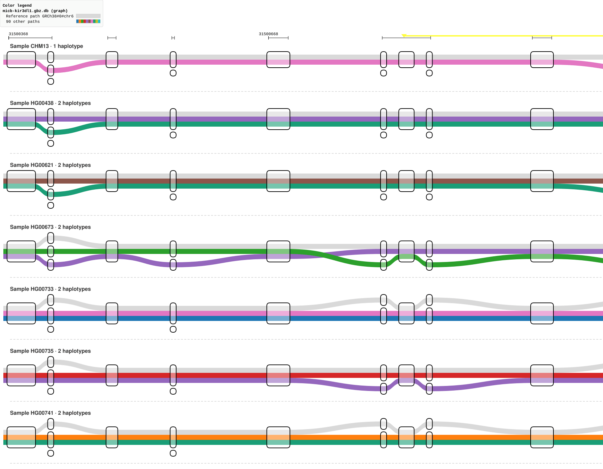

The same window with `--banded-haplotypes`, the top of the stack. Dark bands are
alleles both of a sample's haplotypes carry, light ones alleles only one does,
so HG00733's two haplotypes agree across the window, HG00673's differ at nearly
every bubble, and HG00438's only at the first:

```sh
pnpm tubemap-cli --graph exampleData/micb-kir3dl1.gbz.db \
  --haplotype-index exampleData/micb-kir3dl1.haplotype-index.db \
  --region 'GRCh38#chr6:31500700-31500949' --compressed --banded-haplotypes \
  --facet-by haplotype_sample --legend --out micb-banded.svg
```

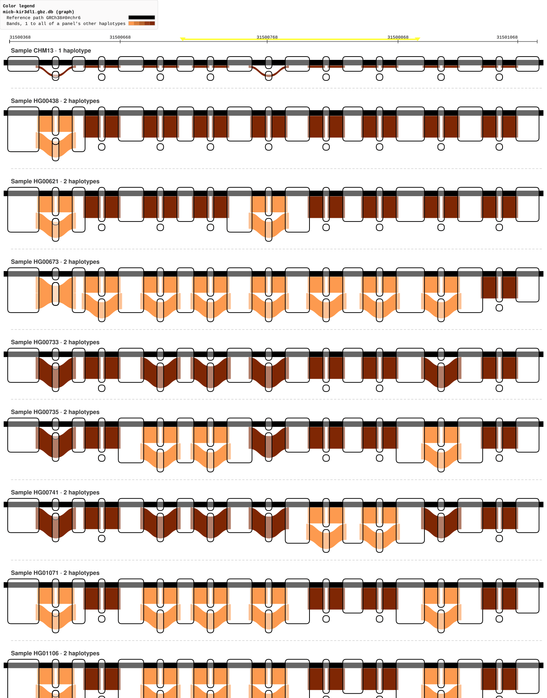

chrM at `GRCh38#chrM:245-255`, banded, the last eight of 42 sample panels above
the reads panel. Each HPRC sample carries one chrM haplotype, so each panel
holds one tube. Most of these samples share the same few alternate alleles,
while NA18906 carries none of them and takes an A and a G further right instead.
The reads are the simulated three-sample fixture above, banded under
`--coarsened`:

```sh
pnpm tubemap-cli --graph exampleData/hprc-chrM.gbz.db \
  --haplotype-index exampleData/hprc-chrM.haplotype-index.db \
  --reads exampleData/hprc-chrM-3samples.sorted.gam \
  --region 'GRCh38#chrM:245-255' --banded-haplotypes --ignore-strand \
  --coarsened --facet-by haplotype_sample --out chrM.svg
```

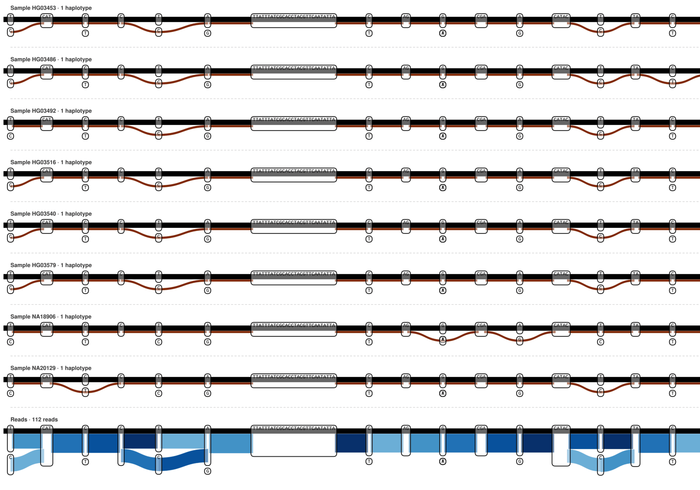

## The color key

`--legend` draws the app's color legend into the figure, above the map, so a
reader who never opens the app can tell what a color means:

```bash
pnpm tubemap-cli --source 'snp1kg-BRCA1 (gbz-base)' --legend --out brca1.svg
```

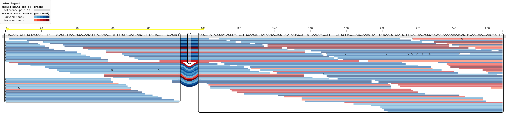

It keys what the figure draws, in the colors it draws them: the reference path
as the one swatch it takes from `mainPalette`, each other path by name in its
`auxPalette` color while that palette can tell them apart, and reads by strand,
group or mapping quality as the view colors them. A file whose tracks are all
out of view, hidden or filtered gets no rows rather than a key to colors nothing
has. The **Download Image** button in the app saves the same key, whenever the
legend panel is open.

Pass it where a color means something, and leave it off where it does not. None
of the `--example` datasets contain a wholly reverse-strand read, so a key on
one of those figures names a red palette the picture never uses, over tracks
called "Demo graph" — which is why the samples below carry one only on real
data.

## Reads

Unlike the browser, which subsamples to 100 reads by default to stay responsive,
the CLI draws every read in the region. `--read-limit N` applies the same even
subsampling when a high-coverage region would otherwise produce an unusably
large SVG:

```bash
pnpm tubemap-cli --source 'snp1kg-BRCA1 (gbz-base)' \
                 --region 17:1-300 --read-limit 100 --out brca1-sampled.svg
```

The cap does not apply under `--coarsened`, which weighs each band by how many
reads traverse it: thinning the reads there would redraw the picture rather than
simplify it. The app leaves the coarsened view uncapped for the same reason.

## Hosted graphs

A source whose graph is a URL is read by range request here as it is in the
browser, companion haplotype index included, so a figure over HPRC release 2.1
needs no local copy of its 10 GB database:

```bash
pnpm tubemap-cli --source 'HPRC v2.1 whole genome (gbz-base, URL-hosted)' \
                 --region 'GRCh38#chr20:48000600-48001000' --coarsened \
                 --out str.svg
```

That is 464 haplotypes on 240 distinct walks. Drawn at one lane per haplotype
that comes out 23036 by 1549 units — too wide for a page, and at that many lanes
solid color soup: 464 haplotypes read as noise, not signal. `--coarsened` (see
[View options](#view-options) above) fixes both: with no reads loaded, it
aggregates every haplotype but the reference into one band per node-to-node edge
instead, each shaded by its share of the haplotypes, so the figure comes out
13300 by 373. The [README](../README.md)'s two chr20 figures are crops of it,
one over the allele staircase and one where the haplotypes come back into
register:

```bash
rsvg-convert -z 1 str.svg -o str.png
magick str.png -crop 3515x385+1165+0 +repage -background white -flatten \
  doc/images/hprc-v2.1-chr20-str.png
magick str.png -crop 1239x385+9988+0 +repage -background white -flatten \
  doc/images/hprc-v2.1-chr20-register.png
```

A local track file is staged as an upload rather than fetched, so the bundled
sources render the same way with no network at all.

## Gallery

The figures below show banded layers and read encodings on the small HPRC graphs
and GAMs in `exampleData/visualization_examples/`. Each block regenerates its
figure from the repo root, after setting `d=exampleData/visualization_examples`;
the SVGs it leaves behind are scratch.

`--banded-haplotypes` folds the 19 non-reference haplotypes into orange bands
shaded by their share, so each SNP's population split sits right above one
sample's reads: they take both alleles at the first SNP and only the upper one
at the second.

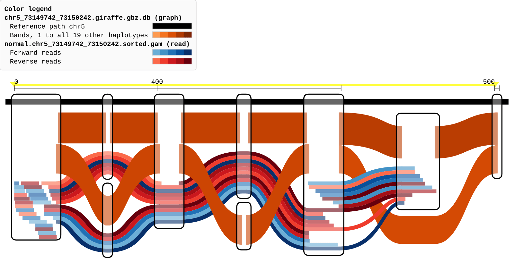

```bash
pnpm tubemap-cli --graph $d/chr5_73149742_73150242.giraffe.gbz.db \
  --reads $d/normal.chr5_73149742_73150242.sorted.gam --region chr5:1-500 \
  --compressed --banded-haplotypes --read-limit 40 --legend --out banded.svg
rsvg-convert -w 1600 banded.svg | magick - -background white -flatten \
  doc/images/layers-banded-haplotypes.png
```

`--read-limit 40` thins the chr5 window's 285 reads so the figure stays one page
tall. Adding `--coarsened` bands all 285 instead, in blue under the orange,
which turns the whole window into allele balance at a glance: the darker
haplotype band through the last bubble's node carries more haplotypes than the
lighter one around it.

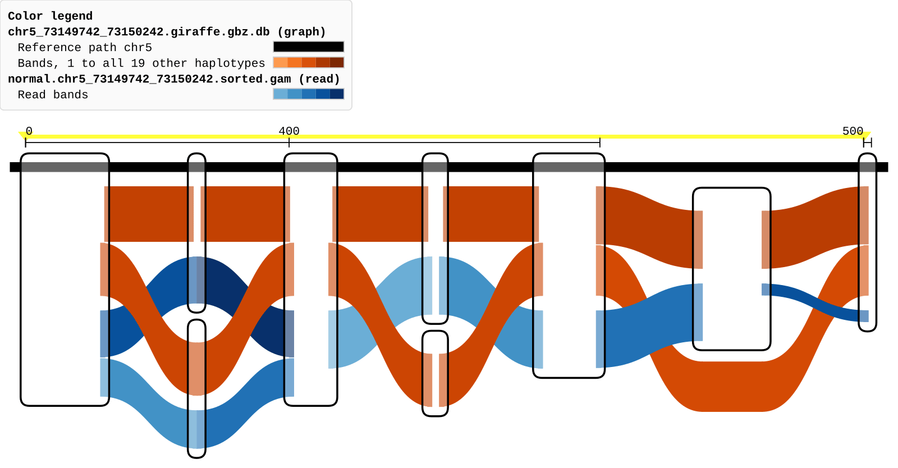

```bash
pnpm tubemap-cli --graph $d/chr5_73149742_73150242.giraffe.gbz.db \
  --reads $d/normal.chr5_73149742_73150242.sorted.gam --region chr5:1-500 \
  --compressed --banded-haplotypes --coarsened --legend --out both.svg
rsvg-convert -w 1600 both.svg | magick - -background white -flatten \
  doc/images/layers-banded-haplotypes-and-reads.png
```

A dense pileup is where banding pays most. Drawn per read, the HCC1395 tumor
sample's 1,076 reads fill the window with stripes; `--coarsened` draws the same
window as 6 bands, and the reads that skip the node at 1756 become one band to
weigh against the rest.

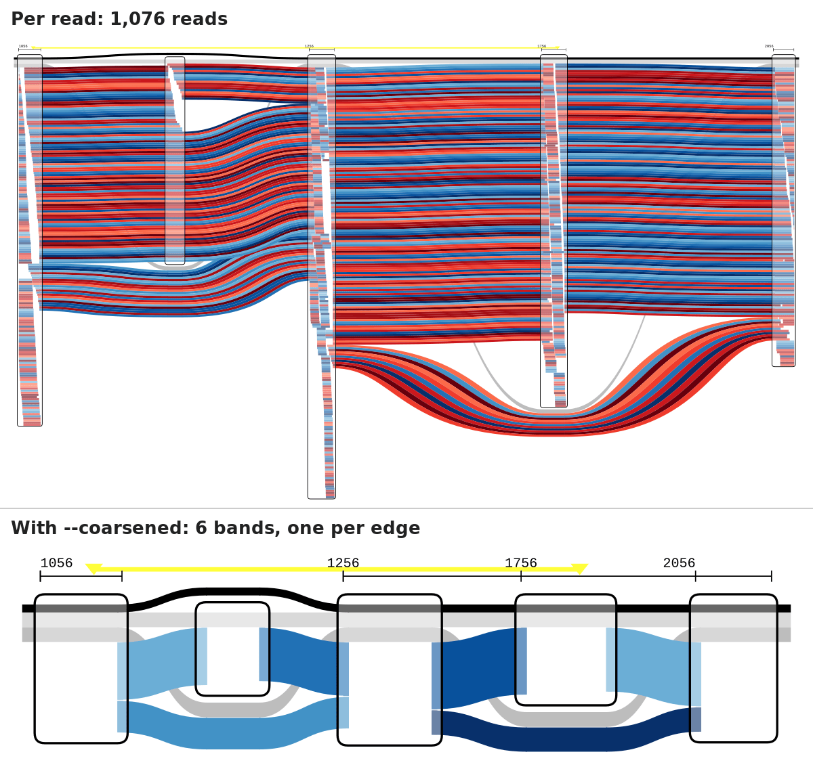

```bash
for view in reads bands; do
  [ $view = bands ] && extra=--coarsened || extra=
  pnpm tubemap-cli --graph $d/chr7_124051614_124054114__HCC1395.giraffe.gbz.db \
    --reads $d/Tumor_HCC1395.chr7_124051614_124054114.sorted.gam \
    --region ref0:1184-1923 --compressed $extra --out $view.svg
  rsvg-convert -w 1168 $view.svg | magick - -background white -flatten \
    -bordercolor white -border 16x8 $view.png
done
title() {
  magick -size 1200x56 xc:white -font DejaVu-Sans-Bold -pointsize 26 \
    -fill '#222' -gravity west -annotate +16+0 "$1" png:-
}
title 'Per read: 1,076 reads' > t1.png
title 'With --coarsened: 6 bands, one per edge' > t2.png
magick t1.png reads.png -size 1200x2 xc:'#ccc' t2.png bands.png -append \
  +repage -depth 8 doc/images/layers-reads-vs-bands.png
```

Mapping quality says how far to trust the HCC1395 tumor reads that skip the
middle node below. Colored by it (top), the poorly mapped reads cluster among
them rather than scattering through the pileup; `--alpha-by-mapq` (bottom) keeps
the strand colors and fades the same reads. Both panels crop to the bottom of
the pileup, where that band runs, and enlarge the legend so it reads at page
width.

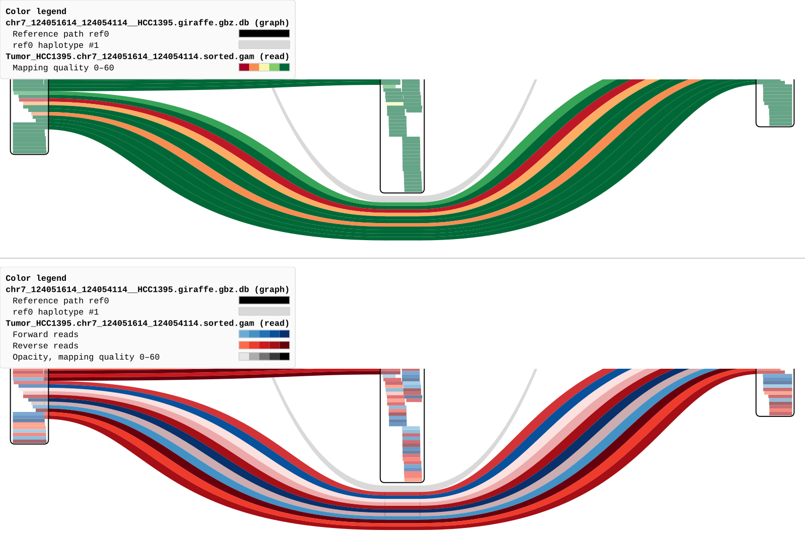

```bash
for enc in color alpha; do
  pnpm tubemap-cli --graph $d/chr7_124051614_124054114__HCC1395.giraffe.gbz.db \
    --reads $d/Tumor_HCC1395.chr7_124051614_124054114.sorted.gam \
    --region ref0:1700-1800 --compressed --$enc-by-mapq --legend --out $enc.svg
  rsvg-convert -w 1600 $enc.svg | magick - -background white -flatten \
    -gravity south -crop 1600x331+0+0 +repage $enc-map.png
done
# the legend is 112 units tall on color.svg and 144 on alpha.svg
rsvg-convert -z 1.4 color.svg | magick - -background white -flatten \
  -crop 588x158+0+0 +repage color-key.png
rsvg-convert -z 1.4 alpha.svg | magick - -background white -flatten \
  -crop 588x203+0+0 +repage alpha-key.png
magick -background white color-key.png color-map.png \
  -size 1600x24 xc:white -size 1600x2 xc:'#ccc' -size 1600x16 xc:white \
  alpha-key.png alpha-map.png -append +repage -depth 8 \
  doc/images/layers-mapq.png
```

The committed PNGs went through `pngquant --quality=80-98 --strip` as well.

## Sample output

Everything below lives in [tubemap-cli-samples/](tubemap-cli-samples/), SVG
alongside PNG, and `scripts/make-cli-samples.sh` regenerates the lot.

`--source 'snp1kg-BRCA1 (gbz-base)' --legend`
([SVG](tubemap-cli-samples/snp1kg-BRCA1.svg))


`--example 8` — a cyclic graph, whose loops are drawn outside the node bounds
([SVG](tubemap-cli-samples/demo-example-8.svg))

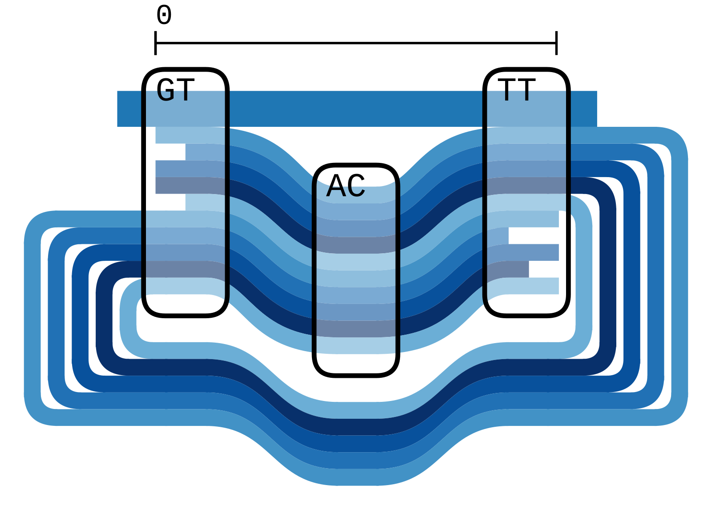

`--example 7` — mixed forward and reverse alignments
([SVG](tubemap-cli-samples/demo-example-7.svg))

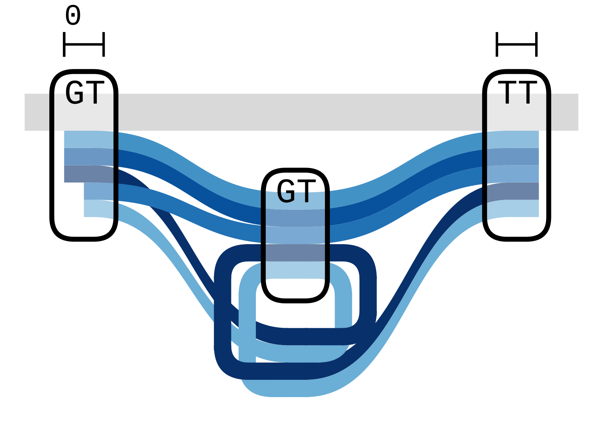

`--example 1` — haplotypes only, no reads
([SVG](tubemap-cli-samples/demo-example-1.svg))

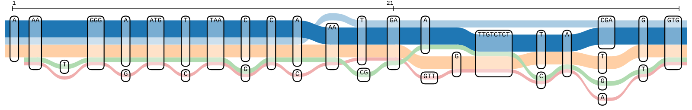

The remaining demo datasets render the same way: examples
[2](tubemap-cli-samples/demo-example-2.png),
[3](tubemap-cli-samples/demo-example-3.png),
[4](tubemap-cli-samples/demo-example-4.png),
[5](tubemap-cli-samples/demo-example-5.png) and
[9](tubemap-cli-samples/demo-example-9.png).

A render whose layout produced non-finite coordinates prints
`warning: N shape(s) have non-finite coordinates and will not appear`. Those
shapes are missing from the picture, so treat the figure as incomplete rather
than shipping it.

Caveat: interactive features (zoom, context menus) are inert in headless mode.
