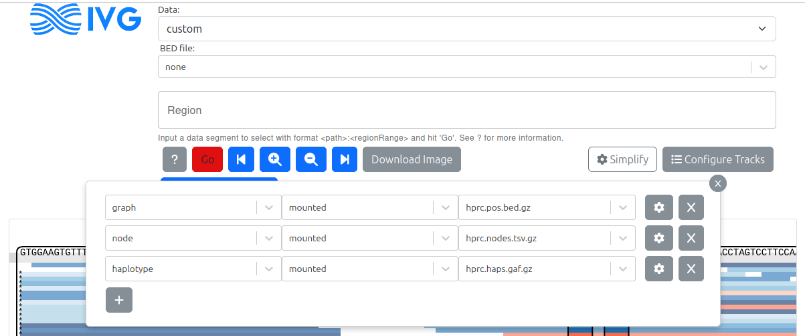
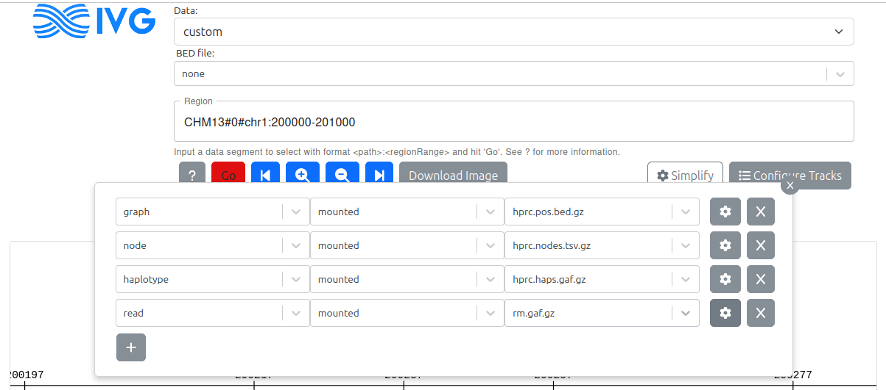
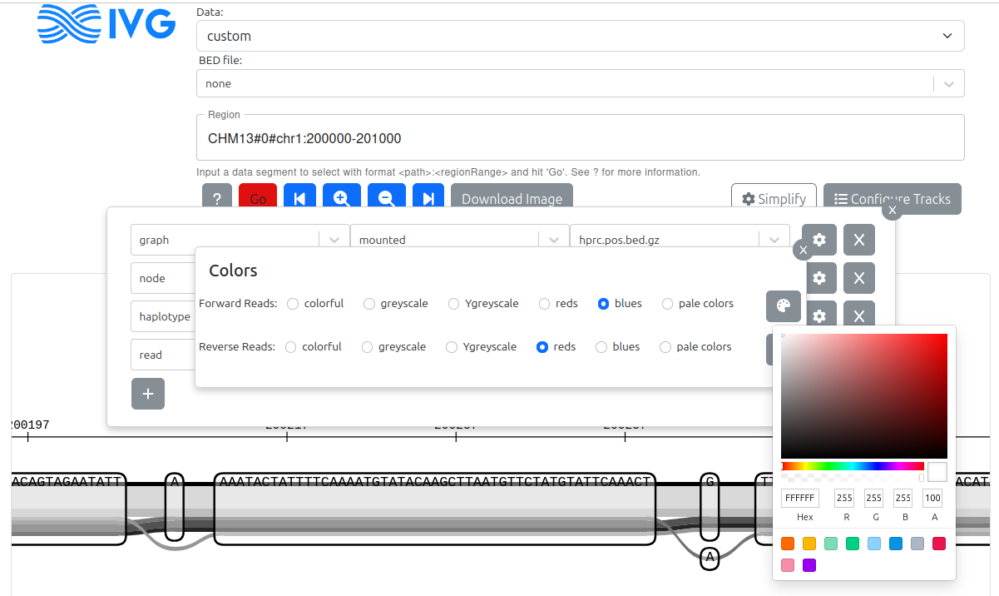

# Running a server

Everything here applies when you run the Express + `vg` backend yourself, for
files over the vgteam server's 5 MB cap or data you don't want to upload. If you
are only uploading files through the dialog or using in-browser mode,
[data.md](data.md) is the doc you want.

## Docker

The [Dockerfile](../docker/Dockerfile) builds an image with the sequenceTubeMap
and its dependencies, published at
[`quay.io/jmonlong/sequencetubemap`](https://quay.io/repository/jmonlong/sequencetubemap).
The image looks for mounted files in `/data`, so with the pangenomes and reads
in the current directory:

```sh
docker run -it -p 3210:3000 -v `pwd`:/data quay.io/jmonlong/sequencetubemap:vg1.74.1
```

`-p` maps the container's port 3000 to 3210; pick any unused port. Then open
http://localhost:3210/.

If the container runs on a server you reach over SSH, tunnel the port to your
machine:

```sh
ssh -N -L 3210:localhost:3210 USER@SERVER
```

To build the image locally and push it, from `docker/`:

```sh
docker build -t sequencetubemap -f Dockerfile ..
docker tag sequencetubemap quay.io/jmonlong/sequencetubemap:vg1.74.1
docker push quay.io/jmonlong/sequencetubemap:vg1.74.1
```

From a checkout, `pnpm start` runs the same server behind the Vite dev server —
see [development.md](development.md).

## The data path

The server looks for data files in `dataPath`, set in `src/config.json` and
defaulting to `exampleData/`:

```json
"dataPath": "<path to my data folder>/",
```

A relative path is resolved against the repository root. Restart the server
after changing it.

To use files from that directory, choose `custom (mounted files)` in the data
dropdown, then click the gear icon to add tracks.

## Request limits

These `src/config.json` settings bound the work one request can make the server
do:

- `requestTimeout` (seconds, default 300): the server kills a request's `vg` and
  chunkix processes and stops its downloads after this long, or as soon as its
  client disconnects.
- `maxRegionBp` (default 2,000,000): the widest path region `vg chunk` is asked
  to cut. The app holds a region wider than 200 kb until the user says to load
  it, and this is the ceiling on what Load anyway can ask for. A pre-fetched BED
  chunk is served whatever its width.
- `fetchTimeout` (seconds, default 15): the longest a single download from a URL
  may take.
- `maxFileSizeBytes` (default 1 GB): the most the files of one chunk downloaded
  from a URL may add up to. A chunk's `chunk_contents.txt` may list at most 100
  files, and a BED file or `chunk_contents.txt` fetched from a URL may be at
  most 10 MiB.

## Built-in Examples entries

The `DATA_SOURCES` array in `src/config.json` populates the **Examples** menu.
Each entry is a `ViewTarget`:

```json
{
  "name": "my example",
  "tracks": [
    { "trackFile": "exampleData/my.gbz.db", "trackType": "graph" },
    { "trackFile": "exampleData/my.gam", "trackType": "read" }
  ],
  "region": "chr1:1-500",
  "bedFile": "exampleData/my.bed",
  "dataType": "built-in"
}
```

Selecting an entry loads it immediately. When the default region is large or
slow to render, add `"skipAutoLoad": true` so the view waits for the user to
press Go.

## Preparing full graphs

Indexing a `.vg` into an `.xg` makes access faster:

```bash
cd scripts/
./prepare_vg.sh <vg_file>
```

If `.vcf.gz` and `.vcf.gz.tbi` files sit next to the `.vg`, they are used to
build a GBWT index of haplotypes from the VCF. That requires the `.vg` to
contain alt paths, from `vg construct -a`.

To index a GAM for region queries:

```bash
cd scripts/
./prepare_gam.sh <gam_file>
```

Both scripts write their output next to the input files, so move the results
into `dataPath` afterwards.

## Pre-fetching subgraphs

The tube map fetches data when a region is queried, which can take 10–20
seconds. Regions you already know you will visit can be extracted ahead of time
into chunk directories referenced from a BED file.

Run `scripts/prepare_chunks.sh` from the directory holding your inputs and
receiving the chunks — normally `dataPath`:

```bash
cd exampleData/
../scripts/prepare_chunks.sh -x mygraph.xg -h mygraph.gbwt -r chr1:1-100 \
  -d 'Region A' -o chunk-chr1-1-100 -g mygam1.gam -g mygam2.gam >> mychunks.bed
../scripts/prepare_chunks.sh -x mygraph.gbz -r chr1:101-200 \
  -d 'Region B' -o chunk-chr1-100-200 -g mygam1.gam -g mygam2.gam >> mychunks.bed
```

The BED file it appends to carries two nonstandard columns — a description of
the region (column 4) and the chunk's output directory (column 5), tab
separated:

```
chr1	1	100	Region A	chunk-chr1-1-100
chr1	101	200	Region B	chunk-chr2-101-200
```

It must live in `dataPath`, or be hosted on the web alongside its chunk
directories and given as a URL.

The server fetches a URL only from a public address: it checks every address it
connects to, redirects included, so a URL can't reach the server's own loopback
interface or the private network it runs on. To fetch from hosts on a private
network, list their addresses or CIDR ranges in `src/config.json`:

```json
"allowedPrivateFetchAddresses": ["10.0.0.0/8", "192.168.1.20"],
```

### Colouring specific nodes

A `nodeColors.tsv` inside a chunk directory — one node name per line — makes
those nodes render in a different colour. `prepare_chunks.sh` writes it from a
space-delimited `-n` argument:

```bash
../scripts/prepare_chunks.sh -x mygraph.xg -h mygraph.gbwt -r chr1:1-100 \
  -d 'Region A' -o chunk-chr1-1-100 -g mygam1.gam -n "1 2 3" >> mychunks.bed
```

## Pre-extracted subgraphs

`scripts/prepare_local_chunk.sh` takes a subgraph that has already been
extracted from a larger graph, rather than a full graph. It supports most of
`prepare_chunks.sh`'s options, apart from haplotype files, and also accepts
`.gaf` files (converted to GAM with `vg convert`).

It assumes the graph covers some region along a reference path present in the
graph, given with `-r`. Path names in the subgraph must _not_ use
bracket-enclosed subregion suffixes, and the name in the region must match a
path in the graph exactly.

```bash
cd exampleData/
../scripts/prepare_local_chunk.sh -x subgraph.gbz -r chr5:1023911-1025911 \
  -g subgraph_reads.gam -g other_sample_reads.gam \
  -g another_sample_reads.gaf -o subgraph1 >> subgraphs.bed
```

The graph can be `.vg`, `.xg`, `.gfa`, or anything else vg understands, but it
**must be in the same node ID space as the reads**, and the script does not
check this. Indexing a GFA and mapping to it with `vg giraffe` can cut the
original GFA nodes into pieces with new numbers, so the original GFA will not
work. Check with `vg validate subgraph.gfa --gam subgraph_reads.gam`; read
alignments that jump around absurdly are the symptom.

Leave the original subgraph file in place under `dataPath` — the tube map reads
it when listing the paths it contains, and errors if it has moved.

The result is that selecting the BED file and its region shows a precomputed
view of the subgraph, with coordinates computed as if it covers the region
passed to `-r`.

### Node ID renaming in GFA files

vg keeps node IDs unchanged when every node name is a strictly positive integer.
String-named nodes trigger renaming: it begins at the first string-named node,
using the highest integer seen so far (+1), or 1 if the very first node is
string-named, and every node after that is renumbered sequentially regardless of
its original name.

```
Original -> Renamed
3 -> 3
1 -> 1
five -> 4
7 -> 5
four -> 6
```

Account for this when interpreting the visualization.

## Tabix-based pangenome indexes

Contributed by [Jean Monlong](https://github.com/jmonlong). An alternative to
`vg chunk` for whole pangenomes: instead of indexing the graph, the server
queries three tabix-indexed flat files directly.

### The index files

Three files are used, each one indexed with tabix (additional `.tbi` file):

1. `nodes.tsv.gz` contains the sequence of each node.
2. `pos.bed.gz` contains the position (as node intervals) of regions on each
   haplotype.
3. `haps.gaf.gz` contains the path followed by each haplotype (split in pieces).

Briefly, these three index files can be quickly queried to extract a subgraph
covering a region of interest: the `pos.bed.gz` index can first tell us which
nodes are covered, then the `nodes.tsv.gz` index gives us the sequence of these
nodes, and finally we can stitch the haplotype pieces in those nodes from the
`haps.gaf.gz` index. This approach was implemented in a
[`chunkix.py`](../scripts/chunkix.py) script which can produce a GFA file or
files used by the sequenceTubeMap. The sequenceTubeMap uses this script
internally when given tabix-based index files.

### Using tabix-based index files in the sequenceTubeMap

Provide them as mounted files:

- the `pos.bed.gz` index in the _graph_ field
- the `nodes.tsv.gz` index in the _node_ field
- the `haps.gaf.gz` index in the _haplotype_ field

---



---

Once the index files are mounted, one can query any region on any haplotype in
the form _HAPNAME_CONTIG:START-END_.

Other tracks, for example reads or annotations in bgzipped/indexed GAF files,
can be added as _reads_ in the menu.

---



---

Of note, you can set a color for each track using the existing palettes or by
picking a specific color.

---



---

### The tabix Docker image

`quay.io/jmonlong/sequencetubemap:tabix_dev` carries all the dependencies, and
runs like the main image:

```sh
docker run -it -p 3210:3000 -v `pwd`:/data quay.io/jmonlong/sequencetubemap:tabix_dev
```

Note: For mounted files, this assumes all files (pangenomes, reads, annotations)
are in the current working directory or in subdirectories. To test with the
files that are already prepared, download all the files (see below). Then,
either use them as _custom_ Data adding the tracks with the _Configure Tracks_
button, or use the prepared Data set "HPRC Minigraph-Cactus v1.1". For info, the
files for this Dataset were defined in the
[config.json file](../docker/config.json) used to build the docker.

### Available tabix-based index files for the Minigraph-Cactus v1.1 pangenome

Index files and some annotations have been deposited at
https://public.gi.ucsc.edu/~jmonlong/sequencetubemap_tabix/

To download it all:

```
# pangenome index files
wget https://public.gi.ucsc.edu/~jmonlong/sequencetubemap_tabix/hprc.haps.gaf.gz
wget https://public.gi.ucsc.edu/~jmonlong/sequencetubemap_tabix/hprc.haps.gaf.gz.tbi
wget https://public.gi.ucsc.edu/~jmonlong/sequencetubemap_tabix/hprc.nodes.tsv.gz
wget https://public.gi.ucsc.edu/~jmonlong/sequencetubemap_tabix/hprc.nodes.tsv.gz.tbi
wget https://public.gi.ucsc.edu/~jmonlong/sequencetubemap_tabix/hprc.pos.bed.gz
wget https://public.gi.ucsc.edu/~jmonlong/sequencetubemap_tabix/hprc.pos.bed.gz.tbi

# annotation files
wget https://public.gi.ucsc.edu/~jmonlong/sequencetubemap_tabix/gene_exon.gaf.gz
wget https://public.gi.ucsc.edu/~jmonlong/sequencetubemap_tabix/gene_exon.gaf.gz.tbi
wget https://public.gi.ucsc.edu/~jmonlong/sequencetubemap_tabix/gwasCatalog.hprc-v1.1-mc-grch38.sorted.gaf.gz
wget https://public.gi.ucsc.edu/~jmonlong/sequencetubemap_tabix/gwasCatalog.hprc-v1.1-mc-grch38.sorted.gaf.gz.tbi
wget https://public.gi.ucsc.edu/~jmonlong/sequencetubemap_tabix/rm.gaf.gz
wget https://public.gi.ucsc.edu/~jmonlong/sequencetubemap_tabix/rm.gaf.gz.tbi
```

### Building tabix-based index files from a GFA

#### Optional: make a GFA from a GBZ file

In some cases, you will want to use exactly the same pangenome space as a
specific GBZ file. For example, to visualize reads or annotation on that
pangenome. The GFA provided in the HPRC repo might not match exactly because
some nodes may have been split when making the GBZ file. You can convert a GBZ
to a GFA (and not translate the nodes back to the original GFA) with:

```sh
vg convert --no-translation -f -t 4 hprc-v1.1-mc-grch38.gbz | gzip >  hprc-v1.1-mc-grch38.gfa.gz
```

#### Run the `pgtabix.py` python script

The `pgtabix.py` script can be found in the [`scripts` directory](../scripts).
It's also present in the `/build/sequenceTubeMap/scripts` directory of the
Docker container `quay.io/jmonlong/sequencetubemap:tabix_dev`.

```sh
python3 pgtabix.py -g hprc-v1.1-mc-grch38.gfa.gz -o output.prefix
```

It takes about 1h30-2h to build index files for the Minigraph-Cactus v1.1
pangenome. This process should scale linearly with the number of haplotypes.

### Making your own annotation files

To make your own annotation files, we have developed a pipeline to project
annotation files at the haplotype level (e.g. BED, GFF) onto a pangenome (e.g.
GBZ). Once the projected GAF files are sorted, bgzipped and indexed, they can be
queried fast, for example by sequenceTubeMap.

The pipeline is described in the
[manuscript](https://jmonlong.github.io/manu-vggafannot/) and script/docs was
deposited in
[the GitHub repository](https://github.com/jmonlong/manu-vggafannot?tab=readme-ov-file).
In particular, example on how annotation files were projected for this
manuscript are described in
[this section](https://github.com/jmonlong/manu-vggafannot/tree/main/analysis/annotate).
